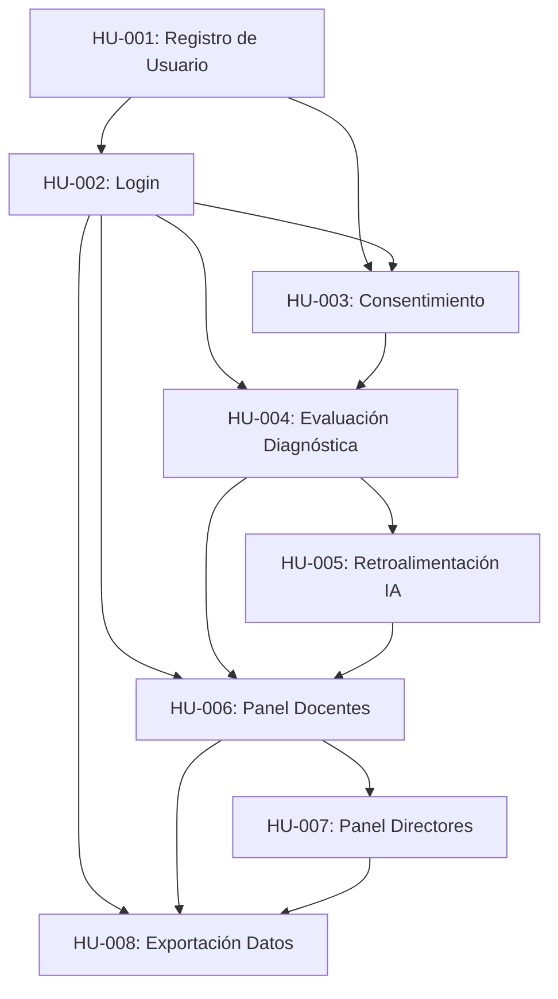

# Historias de Usuario - Plataforma Educativa con IA

## Índice de Historias de Usuario

| ID | Título | Prioridad | Estado |
|----|--------|-----------|--------|
| HU-001 | Registro de Estudiante con Datos de Tutor | Alta | Pendiente |
| HU-002 | Autenticación de Usuarios (Login) | Alta | Pendiente |
| HU-003 | Gestión de Consentimiento y Privacidad de Menores | Alta | Pendiente |
| HU-004 | Evaluación Diagnóstica Inicial de Estudiante | Alta | Pendiente |
| HU-005 | Retroalimentación Inteligente para Alumnos | Alta | Pendiente |
| HU-006 | Panel de Control para Profesores | Alta | Pendiente |
| HU-007 | Panel Ejecutivo para Directores | Media | Pendiente |
| HU-008 | Exportación de Datos y Reportes Personalizados | Media | Pendiente |

---

## HU-001: Registro de Estudiante con Datos de Tutor

### Identificador
**HU-001**

### Título
Registro de Estudiante con Datos de Tutor Manteniendo Privacidad del Menor

### Descripción
Como **administrador escolar o tutor legal**, quiero **registrar a un estudiante menor de edad en la plataforma proporcionando datos mínimos del estudiante y datos completos del tutor responsable**, para **garantizar el cumplimiento de normativas de protección de datos de menores (COPPA, Ley 29733) y establecer una cuenta segura vinculada a un responsable adulto**.

### Contexto Técnico
- El sistema debe cumplir con la Ley de Protección de Datos Personales del Perú (Ley 29733) y COPPA (Children's Online Privacy Protection Act).
- Los estudiantes son menores de edad (8-12 años) y requieren consentimiento parental explícito.
- Los datos sensibles del menor deben ser mínimos, anonimizados internamente y encriptados.
- El tutor legal es el responsable de la cuenta y debe poder gestionar permisos y privacidad.
- Integración con módulo de autenticación OAuth 2.0.
- Base de datos: PostgreSQL para datos de usuarios, con separación de tablas `students` y `guardians`.

### Criterios de Aceptación

1. **Formulario de Registro Bifurcado**:
   - El formulario debe solicitar datos mínimos del estudiante: nombre, apellido, fecha de nacimiento, grado escolar, género (opcional).
   - NO debe solicitar: dirección completa, teléfono personal del menor, correo electrónico del menor.
   - El formulario debe solicitar datos completos del tutor: nombre completo, relación con el menor, correo electrónico, teléfono, DNI (encriptado).

2. **Validaciones de Seguridad**:
   - La fecha de nacimiento debe confirmar que el estudiante tiene entre 8-12 años (validación de edad).
   - El correo electrónico del tutor debe ser único en el sistema.
   - El DNI del tutor debe validarse con formato peruano (8 dígitos).
   - Se debe generar un ID único anonimizado para el estudiante (UUID).

3. **Consentimiento Explícito**:
   - El tutor debe aceptar explícitamente el tratamiento de datos mediante checkbox obligatorio.
   - Debe mostrarse un resumen claro de qué datos se recopilan y con qué fin.
   - El sistema debe guardar timestamp del consentimiento.

4. **Privacidad y Encriptación**:
   - Datos sensibles del tutor (DNI, teléfono) deben encriptarse en la base de datos (AES-256).
   - El estudiante debe tener un identificador anonimizado para uso interno en analytics.
   - Los logs del sistema no deben contener datos identificables del menor.

5. **Vinculación Tutor-Estudiante**:
   - Se debe crear una relación 1:N entre tutor y estudiantes (un tutor puede gestionar múltiples hijos).
   - El tutor debe poder ver y gestionar todos los estudiantes a su cargo desde su panel.

6. **Confirmación por Correo**:
   - Al completar el registro, se debe enviar un correo de confirmación al tutor con un enlace de verificación.
   - La cuenta del estudiante debe permanecer inactiva hasta que el tutor verifique su correo.

7. **Manejo de Errores**:
   - Si el correo del tutor ya existe, mostrar mensaje claro y ofrecer opción de login o recuperación de contraseña.
   - Si hay errores de validación, mostrar mensajes específicos por campo.

### Consideraciones de Implementación

- **Framework Backend**: Node.js con Express o Python FastAPI.
- **Validación de Formularios**: Usar bibliotecas como Joi (Node.js) o Pydantic (Python) para validación robusta.
- **Encriptación**: Implementar bcrypt para contraseñas y crypto AES-256 para datos sensibles.
- **Base de Datos**:
  - Tabla `guardians`: id, full_name, email (único), encrypted_phone, encrypted_dni, created_at, email_verified.
  - Tabla `students`: id, uuid (anonimizado), first_name, last_name, birth_date, grade, gender, guardian_id (FK), consent_timestamp, created_at.
  - Tabla `guardian_student_relationship`: guardian_id, student_id, relationship_type.
- **Pruebas**:
  - Unit tests para validaciones de formulario.
  - Integration tests para flujo completo de registro.
  - Tests de seguridad para verificar encriptación.
  - Cobertura mínima: 85%.

### Dependencias

- **Depende de**:
  - Configuración inicial de base de datos PostgreSQL.
  - Configuración de servicio de envío de correos (SMTP/SendGrid).
  - Configuración de variables de entorno para claves de encriptación.
- **Bloquea**:
  - HU-002 (Login de Usuarios).
  - HU-003 (Gestión de Consentimiento).
  - HU-004 (Evaluación Diagnóstica Inicial).

### Prioridad / Estimación

- **Prioridad**: Alta (Funcionalidad fundamental bloqueante)
- **Estimación**: 8 puntos de historia / 5-6 días de desarrollo

---

## HU-002: Autenticación de Usuarios (Login)

### Identificador
**HU-002**

### Título
Implementar Autenticación Segura con OAuth2 y Diferenciación de Roles

### Descripción
Como **usuario registrado (tutor, estudiante, docente, director o administrador)**, quiero **iniciar sesión de forma segura utilizando mis credenciales**, para **acceder a las funcionalidades específicas de mi rol en la plataforma**.

### Contexto Técnico
- El sistema debe soportar múltiples roles: Estudiante, Tutor, Docente, Director, Administrador.
- Autenticación basada en OAuth 2.0 con tokens JWT.
- Los estudiantes menores de edad pueden tener autenticación simplificada (usuario generado + PIN).
- Sesiones con expiración automática por inactividad (60 minutos).
- Integración con Redis para gestión de sesiones.
- Soporte para autenticación de dos factores (2FA) opcional para tutores y docentes.

### Criterios de Aceptación

1. **Formulario de Login**:
   - El formulario debe solicitar: correo electrónico/usuario y contraseña.
   - Para estudiantes menores, opción de login simplificado con usuario generado + PIN de 4 dígitos.
   - Debe incluir opción "Recordarme" (sesión persistente hasta cierre manual).
   - Debe incluir enlace a "¿Olvidaste tu contraseña?".

2. **Validación de Credenciales**:
   - El sistema debe validar credenciales contra la base de datos con contraseñas hasheadas (bcrypt).
   - Si las credenciales son incorrectas, mostrar mensaje genérico "Usuario o contraseña incorrectos" (sin especificar cuál es incorrecto).
   - Implementar rate limiting: máximo 5 intentos fallidos por IP en 15 minutos, luego bloqueo temporal.

3. **Generación de Token JWT**:
   - Al autenticarse exitosamente, generar un token JWT con claims: user_id, role, exp (expiración).
   - El token debe tener duración de 60 minutos.
   - Implementar refresh token con duración de 7 días para renovación automática.

4. **Diferenciación de Roles**:
   - Tras autenticación exitosa, redirigir a dashboard específico según rol:
     - **Estudiante**: Dashboard de aprendizaje personalizado.
     - **Tutor**: Dashboard de seguimiento de hijos.
     - **Docente**: Dashboard de gestión de grupos y progreso.
     - **Director**: Dashboard ejecutivo con métricas institucionales.
     - **Administrador**: Panel de administración del sistema.

5. **Gestión de Sesiones**:
   - Almacenar sesiones activas en Redis con TTL de 60 minutos.
   - Actualizar TTL con cada actividad del usuario (sliding expiration).
   - Al cerrar sesión, eliminar token de Redis y blacklistear JWT.

6. **Registro de Auditoría**:
   - Registrar todos los intentos de login (exitosos y fallidos) en tabla `audit_logs`.
   - Incluir: user_id, ip_address, user_agent, timestamp, status (success/failure).

7. **Seguridad Adicional**:
   - Implementar CAPTCHA tras 3 intentos fallidos consecutivos.
   - Notificación por correo al tutor si se detecta login desde nueva IP/dispositivo.
   - Opción de habilitar 2FA (autenticación de dos factores) mediante correo o SMS.

8. **Manejo de Sesiones Concurrentes**:
   - Permitir máximo 3 sesiones activas simultáneas por usuario.
   - Mostrar lista de dispositivos activos y opción de cerrar sesiones remotas.

### Consideraciones de Implementación

- **Autenticación**: Implementar con Passport.js (Node.js) o PyJWT (Python).
- **Tokens**: JWT con algoritmo HS256, almacenar secret en variable de entorno.
- **Redis**: Configurar Redis para almacenamiento de sesiones y blacklist de tokens.
- **Rate Limiting**: Usar express-rate-limit (Node.js) o SlowAPI (Python).
- **CAPTCHA**: Integrar Google reCAPTCHA v3.
- **Base de Datos**:
  - Tabla `users`: id, email, hashed_password, role, is_active, last_login, created_at.
  - Tabla `audit_logs`: id, user_id, action, ip_address, user_agent, timestamp, status.
  - Tabla `active_sessions`: session_id, user_id, token, ip_address, device_info, created_at, expires_at.
- **Pruebas**:
  - Unit tests para validación de credenciales.
  - Integration tests para flujo de login completo.
  - Tests de seguridad para rate limiting y CAPTCHA.
  - Cobertura mínima: 90%.

### Dependencias

- **Depende de**:
  - HU-001 (Registro de Usuarios).
  - Configuración de Redis.
  - Configuración de variables de entorno para JWT secret.
- **Bloquea**:
  - Todas las demás historias de usuario (funcionalidad base).

### Prioridad / Estimación

- **Prioridad**: Alta (Funcionalidad crítica y bloqueante)
- **Estimación**: 10 puntos de historia / 6-7 días de desarrollo

---

## HU-003: Gestión de Consentimiento y Privacidad de Menores

### Identificador
**HU-003**

### Título
Sistema de Gestión de Consentimiento Parental y Privacidad de Datos de Menores

### Descripción
Como **tutor legal de un estudiante menor de edad**, quiero **gestionar los permisos de privacidad y consentimiento de datos de mi hijo/a**, para **controlar qué información se recopila, cómo se utiliza y poder ejercer mis derechos de acceso, rectificación y eliminación conforme a la legislación vigente**.

### Contexto Técnico
- Cumplimiento de COPPA (Children's Online Privacy Protection Act) y Ley 29733 (Perú).
- Los tutores deben tener control total sobre los datos de sus hijos menores de 13 años.
- Implementar sistema de consentimiento granular (por categoría de datos).
- Permitir revocación de consentimiento en cualquier momento.
- Auditoría completa de cambios en configuración de privacidad.

### Criterios de Aceptación

1. **Panel de Privacidad para Tutores**:
   - El tutor debe acceder a un panel de "Privacidad y Consentimiento" desde su dashboard.
   - Debe mostrar lista de todos los estudiantes a su cargo.
   - Para cada estudiante, debe mostrar estado actual de consentimientos.

2. **Consentimientos Granulares**:
   - El sistema debe solicitar consentimiento separado para:
     - Recopilación de datos de progreso académico.
     - Uso de datos para personalización de aprendizaje (IA).
     - Compartir datos anonimizados con docentes.
     - Compartir datos anonimizados con el director.
     - Uso de datos para investigación (anonimizados).
     - Comunicaciones por correo electrónico.
   - Cada consentimiento debe tener toggle on/off con descripción clara.

3. **Información Transparente**:
   - Para cada tipo de consentimiento, debe mostrarse:
     - Qué datos se recopilan.
     - Con qué finalidad.
     - Quién tiene acceso.
     - Cuánto tiempo se almacenan.
   - Enlace a Política de Privacidad completa.

4. **Revocación de Consentimiento**:
   - El tutor debe poder revocar cualquier consentimiento en cualquier momento.
   - Al revocar, el sistema debe:
     - Dejar de recopilar esos datos inmediatamente.
     - Marcar datos existentes como "no utilizables".
     - Mostrar advertencia si la revocación afecta funcionalidades (ej: revocar uso de IA desactiva personalización).

5. **Derecho de Acceso**:
   - El tutor debe poder descargar un archivo JSON/PDF con todos los datos del estudiante.
   - El archivo debe generarse en máximo 48 horas y enviarse por correo seguro.

6. **Derecho de Rectificación**:
   - El tutor debe poder solicitar corrección de datos incorrectos.
   - El sistema debe enviar solicitud a administrador para validación.
   - Debe notificarse al tutor cuando se complete la rectificación.

7. **Derecho al Olvido**:
   - El tutor debe poder solicitar eliminación completa de la cuenta del estudiante.
   - El sistema debe mostrar advertencia clara: "Esta acción es irreversible".
   - Al confirmar, debe:
     - Marcar cuenta como "pendiente de eliminación".
     - Periodo de gracia de 30 días (por si cambia de opinión).
     - Tras 30 días, anonimizar datos irreversiblemente (mantener solo estadísticas agregadas).

8. **Auditoría de Cambios**:
   - Todos los cambios en configuración de privacidad deben registrarse en `privacy_audit_log`.
   - Incluir: timestamp, user_id (tutor), student_id, tipo de cambio, valor anterior, valor nuevo.

9. **Notificaciones de Cambios de Política**:
   - Si hay cambios en Política de Privacidad, notificar a tutores por correo.
   - Solicitar re-confirmación de consentimiento si hay cambios sustanciales.

### Consideraciones de Implementación

- **UI/UX**: Diseñar panel de privacidad claro, visual y fácil de usar (no jerga legal).
- **Base de Datos**:
  - Tabla `consents`: id, student_id, consent_type, granted (boolean), granted_at, revoked_at, updated_by (tutor_id).
  - Tabla `privacy_audit_log`: id, student_id, tutor_id, action, details, timestamp.
  - Tabla `data_deletion_requests`: id, student_id, requested_by, requested_at, scheduled_deletion_at, status.
- **Exportación de Datos**: Generar PDF/JSON con biblioteca como PDFKit (Node.js) o ReportLab (Python).
- **Anonimización**: Implementar función de anonimización que reemplace datos personales con hashes irreversibles, manteniendo estadísticas agregadas.
- **Pruebas**:
  - Unit tests para lógica de consentimientos.
  - Integration tests para flujo completo de gestión de privacidad.
  - Tests de cumplimiento legal con casos de COPPA y Ley 29733.
  - Cobertura mínima: 85%.

### Dependencias

- **Depende de**:
  - HU-001 (Registro de Usuarios).
  - HU-002 (Login de Usuarios).
- **Bloquea**:
  - HU-004 (Evaluación Diagnóstica - requiere consentimiento activo).

### Prioridad / Estimación

- **Prioridad**: Alta (Requisito legal obligatorio)
- **Estimación**: 8 puntos de historia / 5-6 días de desarrollo

---

## HU-004: Evaluación Diagnóstica Inicial de Estudiante

### Identificador
**HU-004**

### Título
Implementar Evaluación Diagnóstica Adaptativa para Identificar Nivel y Estilo de Aprendizaje

### Descripción
Como **estudiante nuevo en la plataforma**, quiero **completar una evaluación diagnóstica inicial adaptativa**, para **que el sistema identifique mi nivel académico actual, estilo de aprendizaje y áreas de fortaleza/debilidad, y pueda generar una ruta de aprendizaje personalizada**.

### Contexto Técnico
- Evaluación adaptativa: la dificultad se ajusta dinámicamente según respuestas del estudiante.
- Evalúa dos dimensiones: nivel académico (Matemática y Comunicación) y estilo de aprendizaje (VARK: Visual, Auditivo, Lectoescritor, Kinestésico).
- Integración con motor de IA para análisis de respuestas y generación de perfil.
- Duración aproximada: 20-30 minutos.
- Base de datos de ítems de evaluación categorizados por grado, área y dificultad.

### Criterios de Aceptación

1. **Inicio de Evaluación**:
   - Tras primer login del estudiante, debe mostrarse pantalla de bienvenida explicando la evaluación.
   - Debe incluir video breve (2-3 min) con instrucciones en lenguaje apropiado para niños.
   - Opción de pausar y retomar más tarde (guardar progreso).

2. **Estructura de la Evaluación**:
   - **Parte 1: Matemática** (10-12 ítems adaptativos):
     - Operaciones básicas, resolución de problemas, geometría, fracciones.
     - Comenzar con nivel medio del grado declarado.
     - Si responde correctamente, aumentar dificultad; si falla, disminuir.
   - **Parte 2: Comunicación** (10-12 ítems adaptativos):
     - Comprensión lectora, vocabulario, gramática, producción textual.
     - Mismo mecanismo adaptativo.
   - **Parte 3: Estilos de Aprendizaje** (8-10 ítems):
     - Preguntas sobre preferencias de estudio: ¿Prefieres leer o ver videos?
     - Actividades prácticas vs. teóricas.
     - Basado en modelo VARK.

3. **Algoritmo Adaptativo**:
   - Implementar algoritmo de CAT (Computerized Adaptive Testing).
   - Cada ítem tiene parámetros: dificultad (1-5), discriminación, área temática.
   - Tras cada respuesta, recalcular nivel estimado del estudiante (θ).
   - Seleccionar siguiente ítem que maximice información (cerca de θ estimado).

4. **Interfaz Adaptada a Niños**:
   - Diseño colorido, con ilustraciones y gamificación.
   - Barra de progreso visual (evitar generar ansiedad).
   - Feedback positivo tras cada respuesta ("¡Buen trabajo!", "¡Sigue así!").
   - Soporte multimedia: audio de enunciados para estudiantes con dificultades lectoras.

5. **Generación de Perfil**:
   - Al completar, el motor de IA debe generar:
     - **Nivel académico**: Por debajo, En nivel, Por encima (para cada área).
     - **Estilo de aprendizaje dominante**: Visual / Auditivo / Lectoescritor / Kinestésico (con porcentajes).
     - **Áreas de fortaleza**: Top 3 temas con mejor desempeño.
     - **Áreas de oportunidad**: Top 3 temas con más dificultad.
   - Guardar perfil en tabla `student_profiles`.

6. **Reporte para Tutor y Docente**:
   - Generar reporte PDF con resultados de la evaluación.
   - Enviar por correo al tutor.
   - Hacer visible en dashboard del docente.
   - Incluir recomendaciones pedagógicas automáticas.

7. **Validación y Refinamiento**:
   - El sistema debe permitir que docentes revisen y ajusten manualmente el perfil si lo consideran necesario.
   - Opción de re-evaluación cada 3 meses para actualizar perfil.

8. **Accesibilidad**:
   - Soporte para lectores de pantalla.
   - Opción de aumentar tamaño de texto.
   - Contraste alto para estudiantes con dificultades visuales.

### Consideraciones de Implementación

- **Banco de Ítems**: Crear base de datos con 200+ ítems por grado y área, validados pedagógicamente.
- **Algoritmo CAT**: Implementar con biblioteca como catR (R) o adaptarlo en Python con numpy.
- **Motor de IA**: Usar GPT-4/Claude para análisis cualitativo de respuestas abiertas y generación de recomendaciones.
- **Base de Datos**:
  - Tabla `assessment_items`: id, area, grade, difficulty, discrimination, type, content, correct_answer, options.
  - Tabla `student_assessments`: id, student_id, started_at, completed_at, status.
  - Tabla `student_responses`: id, assessment_id, item_id, response, is_correct, response_time, theta_estimate.
  - Tabla `student_profiles`: id, student_id, math_level, communication_level, learning_style, strengths, weaknesses, created_at, updated_at.
- **Generación de PDF**: Usar PDFKit (Node.js) o ReportLab (Python).
- **Pruebas**:
  - Unit tests para algoritmo adaptativo.
  - Integration tests para flujo completo de evaluación.
  - Tests de usabilidad con estudiantes reales (piloto).
  - Cobertura mínima: 85%.

### Dependencias

- **Depende de**:
  - HU-001 (Registro de Usuarios).
  - HU-002 (Login de Usuarios).
  - HU-003 (Consentimiento de Privacidad - debe estar activo).
  - Banco de ítems de evaluación creado por equipo pedagógico.
- **Bloquea**:
  - HU-005 (Retroalimentación Inteligente - requiere perfil del estudiante).

### Prioridad / Estimación

- **Prioridad**: Alta (Funcionalidad clave para personalización)
- **Estimación**: 13 puntos de historia / 8-10 días de desarrollo

---

## HU-005: Retroalimentación Inteligente para Alumnos

### Identificador
**HU-005**

### Título
Implementar Sistema de Retroalimentación Inmediata Basado en IA para Estudiantes

### Descripción
Como **estudiante**, quiero **recibir retroalimentación inmediata, personalizada y constructiva sobre mis actividades y evaluaciones**, para **comprender mis errores, reforzar conceptos y mejorar mi aprendizaje de manera autónoma**.

### Contexto Técnico
- Retroalimentación generada por IA (GPT-4/Claude) adaptada al nivel del estudiante.
- Debe ser inmediata (< 3 segundos tras enviar respuesta).
- Incluye explicaciones paso a paso, recursos complementarios y sugerencias de mejora.
- Adaptación al perfil de aprendizaje (visual, auditivo, kinestésico, lectoescritor).
- Integración con sistema de gamificación (puntos, badges por mejora).

### Criterios de Aceptación

1. **Retroalimentación Inmediata**:
   - Tras enviar una respuesta (correcta o incorrecta), el estudiante debe recibir feedback en máximo 3 segundos.
   - El feedback debe ser visible en la misma pantalla sin necesidad de navegación.

2. **Retroalimentación Diferenciada**:
   - **Si la respuesta es correcta**:
     - Mensaje de felicitación personalizado.
     - Explicación breve del concepto aplicado.
     - Otorgar puntos de gamificación (+10 puntos).
     - Opción de "desafío adicional" (actividad de extensión).
   - **Si la respuesta es incorrecta**:
     - Mensaje empático ("No te preocupes, aprender implica equivocarse").
     - Identificación del error específico.
     - Explicación paso a paso de la solución correcta.
     - Recursos complementarios (video, lectura, ejercicio guiado).
     - Oportunidad de reintentar (máximo 2 intentos adicionales con pistas progresivas).

3. **Adaptación al Estilo de Aprendizaje**:
   - Basándose en el perfil del estudiante, adaptar el formato de retroalimentación:
     - **Visual**: Incluir diagramas, infografías, videos explicativos.
     - **Auditivo**: Opción de escuchar explicación narrada.
     - **Lectoescritor**: Texto detallado con ejemplos.
     - **Kinestésico**: Actividades prácticas interactivas, simulaciones.

4. **Nivel de Complejidad del Lenguaje**:
   - La IA debe adaptar el lenguaje al grado del estudiante (3° a 6° primaria).
   - Evitar jerga técnica excesiva.
   - Usar ejemplos concretos y cercanos a la realidad del estudiante.

5. **Pistas Progresivas en Caso de Error**:
   - **Primera pista** (tras 1er error): Pregunta guía ("¿Qué operación necesitamos hacer primero?").
   - **Segunda pista** (tras 2do error): Ejemplo similar resuelto paso a paso.
   - **Solución completa** (tras 3er intento): Mostrar solución detallada y permitir avanzar.

6. **Análisis de Patrones de Error**:
   - El sistema debe identificar patrones de errores recurrentes del estudiante.
   - Si detecta 3+ errores en el mismo concepto, generar:
     - Alerta al docente.
     - Sugerencia de actividad de refuerzo automática.
     - Reajuste de ruta de aprendizaje para incluir más práctica en ese tema.

7. **Retroalimentación en Actividades Abiertas**:
   - Para respuestas de texto libre (ej: ensayos, resolución de problemas explicados):
     - Usar IA para analizar: coherencia, gramática, uso de vocabulario, razonamiento lógico.
     - Generar comentarios específicos sobre fortalezas y áreas de mejora.
     - Sugerir mejoras concretas (no solo señalar errores).

8. **Registro de Retroalimentación**:
   - Guardar todas las interacciones de retroalimentación en base de datos para análisis posterior.
   - Permitir que el estudiante revise retroalimentaciones pasadas en su "historial de aprendizaje".

9. **Gamificación Asociada**:
   - Otorgar badges especiales: "Perseverante" (tras varios intentos), "Perfeccionista" (respuesta correcta al primer intento), "Curioso" (consulta recursos complementarios).

### Consideraciones de Implementación

- **Motor de IA**: Integrar API de GPT-4 o Claude con prompts optimizados para educación primaria.
- **Caché de Respuestas Comunes**: Para respuestas frecuentes, cachear feedback en Redis (reduce costos de API y mejora latencia).
- **Banco de Recursos**: Crear biblioteca de videos, infografías, actividades interactivas categorizadas por tema y estilo de aprendizaje.
- **Base de Datos**:
  - Tabla `feedback_logs`: id, student_id, activity_id, response, feedback_generated, timestamp, ai_model_used.
  - Tabla `error_patterns`: id, student_id, concept, error_count, last_occurrence, remedial_action.
- **Análisis de Texto**: Usar NLP para analizar respuestas abiertas (spaCy, NLTK).
- **Pruebas**:
  - Unit tests para generación de feedback según tipo de respuesta.
  - Integration tests para flujo completo de actividad + retroalimentación.
  - Tests de usabilidad con estudiantes (validar comprensibilidad del feedback).
  - Tests de rendimiento (respuesta en < 3 segundos).
  - Cobertura mínima: 85%.

### Dependencias

- **Depende de**:
  - HU-004 (Evaluación Diagnóstica - requiere perfil de aprendizaje).
  - Integración de API de IA (GPT-4/Claude).
  - Banco de recursos complementarios creado.
- **Bloquea**:
  - Ninguna (puede desarrollarse en paralelo con otras HUs).

### Prioridad / Estimación

- **Prioridad**: Alta (Funcionalidad diferenciadora clave)
- **Estimación**: 13 puntos de historia / 8-10 días de desarrollo

---

## HU-006: Panel de Control para Profesores

### Identificador
**HU-006**

### Título
Desarrollar Dashboard Integral de Seguimiento y Gestión para Docentes

### Descripción
Como **docente**, quiero **acceder a un panel de control centralizado donde pueda visualizar el progreso de mis estudiantes, identificar alertas tempranas, asignar actividades, generar reportes y gestionar mi aula virtual**, para **optimizar mi tiempo, tomar decisiones pedagógicas informadas y brindar apoyo personalizado a quienes más lo necesitan**.

### Contexto Técnico
- Dashboard web responsivo con visualizaciones interactivas (gráficos, tablas).
- Integración con módulo de IA para generar insights y alertas automáticas.
- Acceso en tiempo real a datos de progreso estudiantil.
- Funcionalidades de gestión de grupos, asignación de tareas y comunicación.
- Exportación de reportes en PDF/Excel.

### Criterios de Aceptación

1. **Vista General del Dashboard**:
   - Al iniciar sesión, el docente debe ver:
     - Resumen de grupos/aulas a su cargo.
     - Número total de estudiantes activos.
     - Promedio de progreso general (%).
     - Alertas activas (estudiantes en riesgo académico).
     - Actividades pendientes de revisión.

2. **Gestión de Grupos**:
   - El docente debe poder crear, editar y eliminar grupos de estudiantes.
   - Asignar estudiantes a grupos específicos.
   - Ver lista de estudiantes por grupo con foto, nombre y estado de actividad.

3. **Visualización de Progreso Individual**:
   - Al seleccionar un estudiante, debe mostrarse:
     - Perfil de aprendizaje (nivel, estilo).
     - Progreso por área (Matemática, Comunicación) con gráficos de barras.
     - Actividades completadas vs. pendientes.
     - Tiempo promedio de uso diario/semanal.
     - Conceptos dominados vs. en proceso.
     - Historial de evaluaciones con tendencias (gráfico de línea).

4. **Visualización de Progreso Grupal**:
   - Dashboard con métricas agregadas del grupo:
     - Distribución de niveles académicos (gráfico de torta).
     - Tasa de completitud de actividades (%).
     - Estudiantes con mayor y menor progreso (ranking).
     - Conceptos con mayor dificultad para el grupo (heatmap).
     - Comparativa de áreas (Matemática vs. Comunicación).

5. **Sistema de Alertas Tempranas**:
   - Notificaciones automáticas generadas por IA cuando:
     - Un estudiante no accede a la plataforma por 3+ días.
     - Un estudiante tiene 3+ evaluaciones consecutivas con bajo rendimiento.
     - Se detectan patrones de error recurrentes.
     - Tiempo de uso cae abruptamente (posible desmotivación).
   - Las alertas deben categorizarse por prioridad: Alta, Media, Baja.
   - Opción de marcar alerta como "atendida" con nota del docente.

6. **Asignación de Actividades**:
   - El docente debe poder:
     - Explorar biblioteca de actividades por tema, área y dificultad.
     - Asignar actividades a estudiantes individuales o grupos.
     - Establecer fechas de entrega.
     - Personalizar actividades (editar consignas, agregar recursos).
   - Las actividades asignadas deben aparecer en el dashboard del estudiante.

7. **Revisión de Actividades Abiertas**:
   - El docente debe poder:
     - Ver lista de actividades abiertas pendientes de revisión (ensayos, proyectos).
     - Acceder a la respuesta del estudiante y retroalimentación de IA.
     - Agregar comentarios adicionales o corregir retroalimentación de IA.
     - Asignar calificación manual si es necesario.

8. **Generación de Reportes**:
   - El docente debe poder generar reportes en PDF/Excel con:
     - Reporte individual de estudiante (progreso, fortalezas, debilidades, recomendaciones).
     - Reporte grupal (estadísticas agregadas, rankings, áreas de mejora).
     - Reporte de actividades (completitud, promedios, tiempo invertido).
   - Opción de personalizar rango de fechas y métricas incluidas.

9. **Comunicación con Tutores**:
   - Módulo de mensajería interna para contactar a tutores.
   - Envío de notificaciones automáticas sobre alertas o progreso.
   - Historial de comunicaciones.

10. **Recursos Pedagógicos**:
    - Acceso a biblioteca de recursos recomendados por IA según necesidades del grupo.
    - Sugerencias de estrategias de intervención para estudiantes con dificultades.

### Consideraciones de Implementación

- **Frontend**: React.js con bibliotecas de visualización (Chart.js, D3.js, Recharts).
- **Backend**: API RESTful para consultas de datos en tiempo real.
- **Base de Datos**:
  - Optimizar queries con índices en `student_id`, `group_id`, `activity_id`.
  - Vistas materializadas para cálculos agregados (mejorar rendimiento).
- **Caché**: Redis para cachear métricas agregadas (actualización cada 5 minutos).
- **Exportación**: Bibliotecas como jsPDF (PDF) y xlsx (Excel).
- **Notificaciones**: Sistema de colas (RabbitMQ/Redis) para generar alertas en background.
- **Pruebas**:
  - Unit tests para lógica de cálculo de métricas.
  - Integration tests para flujo completo de asignación y revisión de actividades.
  - Tests de rendimiento para queries con grandes volúmenes de datos.
  - Tests de usabilidad con docentes reales.
  - Cobertura mínima: 85%.

### Dependencias

- **Depende de**:
  - HU-001 (Registro de Usuarios).
  - HU-002 (Login de Usuarios).
  - HU-004 (Evaluación Diagnóstica).
  - HU-005 (Retroalimentación Inteligente).
  - Módulo de IA para generación de alertas.
- **Bloquea**:
  - HU-007 (Panel Ejecutivo para Directores - comparte datos agregados).

### Prioridad / Estimación

- **Prioridad**: Alta (Funcionalidad clave para docentes)
- **Estimación**: 13 puntos de historia / 10-12 días de desarrollo

---

## HU-007: Panel Ejecutivo para Directores

### Identificador
**HU-007**

### Título
Desarrollar Dashboard Ejecutivo con Métricas Institucionales para Directores

### Descripción
Como **director de institución educativa**, quiero **acceder a un panel ejecutivo con métricas agregadas de desempeño institucional, comparativas entre grupos y tendencias a lo largo del tiempo**, para **tomar decisiones estratégicas, evaluar el impacto de la plataforma y presentar resultados a stakeholders**.

### Contexto Técnico
- Dashboard de alto nivel con visualizaciones ejecutivas (KPIs, gráficos de tendencias).
- Datos agregados de múltiples grupos y docentes.
- Comparativas intertemporales y benchmarking.
- Integración con motor de IA para generar insights estratégicos.
- Exportación de reportes institucionales para presentaciones.

### Criterios de Aceptación

1. **Vista General del Dashboard Ejecutivo**:
   - Al iniciar sesión, el director debe ver:
     - KPIs principales en tarjetas destacadas:
       - Total de estudiantes activos.
       - Promedio de progreso institucional (%).
       - Tasa de completitud de actividades (%).
       - Estudiantes en riesgo académico (número y %).
       - Promedio de tiempo de uso diario.
     - Gráficos de tendencias (últimos 3 meses): progreso general, engagement, mejora por área.

2. **Análisis por Áreas Curriculares**:
   - Dashboard comparativo de Matemática vs. Comunicación:
     - Porcentaje de estudiantes en cada nivel (Por debajo, En nivel, Por encima).
     - Tendencias de mejora por área (gráfico de línea).
     - Conceptos con mayor dificultad institucional (top 5).

3. **Comparativa entre Grupos/Docentes**:
   - Tabla comparativa con métricas por grupo:
     - Nombre del grupo / Docente a cargo.
     - Número de estudiantes.
     - Progreso promedio (%).
     - Tasa de completitud (%).
     - Estudiantes en riesgo (número).
   - Gráficos de barras para visualizar desempeño relativo.
   - Identificación de grupos de alto y bajo desempeño.

4. **Análisis de Engagement**:
   - Métricas de uso de la plataforma:
     - Usuarios activos diarios/semanales/mensuales.
     - Tiempo promedio de uso por estudiante.
     - Actividades completadas por semana.
     - Tasa de retención (% de estudiantes que usan la plataforma regularmente).
   - Gráficos de tendencias de engagement.

5. **Impacto Pedagógico**:
   - Comparativa pre y post implementación (si hay datos previos):
     - Mejora en evaluaciones estandarizadas.
     - Reducción de brecha de rendimiento entre niveles.
   - Indicadores de cumplimiento de objetivos SMART del proyecto:
     - +25% en matemáticas (progreso actual: X%).
     - +20% en lectura (progreso actual: X%).
     - -50% en tiempo de evaluación docente (progreso actual: X%).

6. **Alertas Institucionales**:
   - Notificaciones de alto nivel:
     - Grupos con bajo desempeño generalizado.
     - Caída abrupta en métricas de engagement.
     - Tendencias negativas en áreas específicas.
   - Recomendaciones estratégicas generadas por IA (ej: "Considerar capacitación adicional en Matemática para docentes del grupo X").

7. **Análisis de Equidad**:
   - Identificación de brechas de desempeño:
     - Por género (si hay datos disponibles).
     - Por nivel socioeconómico (si hay datos disponibles).
     - Por grado.
   - Visualización de brechas con gráficos de dispersión o box plots.

8. **Exportación de Reportes Institucionales**:
   - El director debe poder generar reportes ejecutivos en PDF con:
     - Resumen de KPIs principales.
     - Gráficos de tendencias.
     - Comparativa entre grupos.
     - Análisis de impacto.
     - Recomendaciones estratégicas.
   - Plantillas prediseñadas para presentaciones a Consejo Directivo, UGEL, etc.

9. **Filtros y Personalización**:
   - Filtros por:
     - Rango de fechas.
     - Grado.
     - Área curricular.
     - Grupo específico.
   - Opción de guardar vistas personalizadas (dashboards favoritos).

10. **Proyecciones y Predicciones**:
    - Uso de IA para generar proyecciones:
      - "Si se mantiene la tendencia actual, se espera alcanzar el objetivo de +25% en Matemática en X meses".
      - Identificación de estudiantes con alta probabilidad de alcanzar nivel satisfactorio en próximas evaluaciones.

### Consideraciones de Implementación

- **Frontend**: React.js con bibliotecas de visualización ejecutiva (Chart.js, Recharts, Plotly).
- **Backend**:
  - Queries optimizadas con agregaciones en base de datos.
  - Vistas materializadas para métricas institucionales (actualización diaria o en tiempo real).
- **Caché**: Redis para cachear dashboards ejecutivos (actualización cada 1 hora).
- **IA Analítica**: Integrar modelo de ML para proyecciones y análisis predictivo (Prophet, ARIMA).
- **Base de Datos**:
  - Tabla `institutional_metrics`: id, metric_name, value, date, aggregation_level (institution/group/grade).
  - Vistas materializadas para cálculos pesados.
- **Exportación**: jsPDF con plantillas prediseñadas para reportes ejecutivos.
- **Pruebas**:
  - Unit tests para cálculos de métricas agregadas.
  - Integration tests para generación de reportes.
  - Tests de rendimiento para queries con grandes volúmenes de datos.
  - Tests de usabilidad con directores.
  - Cobertura mínima: 85%.

### Dependencias

- **Depende de**:
  - HU-006 (Panel de Control para Profesores - comparte datos base).
  - HU-001, HU-002, HU-004, HU-005 (fuentes de datos).
  - Módulo de IA para análisis predictivo.
- **Bloquea**:
  - Ninguna (puede desarrollarse en paralelo).

### Prioridad / Estimación

- **Prioridad**: Media (Importante para gestión institucional, pero no bloquea funcionalidades de estudiantes/docentes)
- **Estimación**: 10 puntos de historia / 7-8 días de desarrollo

---

## HU-008: Exportación de Datos y Reportes Personalizados

### Identificador
**HU-008**

### Título
Implementar Sistema de Exportación de Datos y Generación de Reportes Personalizados

### Descripción
Como **docente, director o administrador**, quiero **exportar datos de la plataforma en formatos estándar (CSV, Excel, PDF) y generar reportes personalizados según mis necesidades**, para **realizar análisis externos, cumplir con requisitos institucionales, presentar resultados a stakeholders y respaldar datos**.

### Contexto Técnico
- Sistema de generación de reportes flexible y configurable.
- Soporte para múltiples formatos: CSV, Excel (XLSX), PDF.
- Generación asíncrona para reportes pesados (con notificación al completarse).
- Seguridad: solo exportar datos que el usuario tiene autorización de ver (basado en roles).
- Cumplimiento de normativas de protección de datos (no exportar datos sensibles sin autorización).

### Criterios de Aceptación

1. **Formatos de Exportación Disponibles**:
   - El sistema debe soportar exportación en:
     - **CSV**: Para importación en Excel, Google Sheets, herramientas de análisis.
     - **Excel (XLSX)**: Con formato, tablas y gráficos básicos.
     - **PDF**: Para reportes formales con diseño institucional.

2. **Tipos de Reportes Predefinidos**:
   - **Reporte de Progreso Individual** (PDF):
     - Datos del estudiante.
     - Perfil de aprendizaje.
     - Progreso por área con gráficos.
     - Fortalezas y debilidades.
     - Recomendaciones pedagógicas.
   - **Reporte de Grupo** (Excel/PDF):
     - Lista de estudiantes con métricas principales.
     - Estadísticas agregadas.
     - Gráficos comparativos.
   - **Reporte Institucional** (PDF):
     - KPIs institucionales.
     - Tendencias temporales.
     - Comparativas entre grupos.
     - Análisis de impacto.
   - **Exportación de Datos Brutos** (CSV):
     - Actividades completadas.
     - Evaluaciones con respuestas.
     - Logs de interacción.
     - Datos de progreso temporal.

3. **Generador de Reportes Personalizados**:
   - Interfaz de configuración de reporte donde el usuario pueda:
     - Seleccionar tipo de datos (progreso, evaluaciones, actividades, etc.).
     - Filtrar por: rango de fechas, grupo, estudiante, área curricular.
     - Seleccionar métricas a incluir (checkboxes).
     - Elegir formato de salida (CSV/Excel/PDF).
     - Opción de incluir gráficos (para Excel/PDF).
   - Vista previa antes de generar (para PDFs).

4. **Generación Asíncrona para Reportes Pesados**:
   - Si el reporte requiere procesar más de 1000 registros o tarda más de 10 segundos:
     - Enviar a cola de procesamiento en background.
     - Mostrar mensaje: "Tu reporte se está generando. Recibirás una notificación cuando esté listo".
     - Enviar correo al usuario con enlace de descarga cuando se complete.
     - Enlace de descarga válido por 7 días.

5. **Seguridad y Permisos**:
   - **Docentes**: Solo pueden exportar datos de sus grupos asignados.
   - **Directores**: Pueden exportar datos institucionales completos.
   - **Tutores**: Solo pueden exportar datos de sus hijos.
   - **Administradores**: Acceso completo a todos los datos.
   - Al exportar, anonimizar datos sensibles según configuración de privacidad:
     - No incluir DNI de tutores sin autorización explícita.
     - Anonimizar estudiantes si el reporte es para investigación.

6. **Cumplimiento de Normativas**:
   - Registrar todas las exportaciones en `export_audit_log`:
     - Quién exportó (user_id).
     - Qué datos (tipo de reporte, filtros).
     - Cuándo (timestamp).
     - Para qué fin (campo opcional).
   - Notificar a tutores si se exportan datos de sus hijos (transparencia).

7. **Formato y Diseño de Reportes**:
   - **PDF**:
     - Logo institucional en encabezado.
     - Diseño profesional con colores institucionales.
     - Gráficos de alta calidad.
     - Pie de página con fecha de generación y número de reporte.
   - **Excel**:
     - Hoja de resumen con métricas principales.
     - Hojas adicionales con datos detallados.
     - Tablas con formato condicional (colores según rendimiento).
     - Gráficos embebidos.
   - **CSV**:
     - Encabezados claros.
     - Formato UTF-8 para compatibilidad.
     - Valores separados por comas, textos entre comillas.

8. **Historial de Exportaciones**:
   - Sección en el dashboard donde el usuario pueda ver:
     - Reportes generados previamente (últimos 30 días).
     - Opción de re-descargar reportes recientes.
     - Opción de eliminar reportes descargados.

9. **Límites y Control de Uso**:
   - Máximo 10 exportaciones por día por usuario (para evitar abuso).
   - Tamaño máximo de archivo: 50 MB.
   - Si se exceden límites, mostrar mensaje claro y contacto de soporte.

### Consideraciones de Implementación

- **Generación de Archivos**:
  - **CSV**: Usar csv library nativa de Node.js/Python.
  - **Excel**: Usar ExcelJS (Node.js) o openpyxl (Python).
  - **PDF**: Usar PDFKit (Node.js) o ReportLab (Python).
- **Procesamiento Asíncrono**: Implementar con colas (Bull/BullMQ para Node.js, Celery para Python).
- **Almacenamiento Temporal**: Guardar reportes generados en S3 o almacenamiento local temporal con TTL de 7 días.
- **Base de Datos**:
  - Tabla `export_audit_log`: id, user_id, report_type, filters, format, timestamp, purpose, file_size.
  - Tabla `generated_reports`: id, user_id, file_name, file_path, generated_at, expires_at, download_count.
- **Notificaciones**: Integrar con servicio de correo para notificar cuando reporte está listo.
- **Pruebas**:
  - Unit tests para generación de cada formato.
  - Integration tests para flujo completo de exportación.
  - Tests de seguridad (verificar que usuarios no puedan exportar datos no autorizados).
  - Tests de rendimiento para reportes pesados.
  - Cobertura mínima: 85%.

### Dependencias

- **Depende de**:
  - HU-001, HU-002 (Autenticación y roles).
  - HU-006, HU-007 (Fuentes de datos de docentes y directores).
  - Sistema de colas configurado.
  - Servicio de almacenamiento (S3 o local).
- **Bloquea**:
  - Ninguna (funcionalidad complementaria).

### Prioridad / Estimación

- **Prioridad**: Media (Funcionalidad importante pero no bloqueante)
- **Estimación**: 8 puntos de historia / 6-7 días de desarrollo

---

## Resumen de Dependencias

---

## Matriz de Prioridades

| Historia de Usuario | Prioridad | Estimación | Orden Sugerido de Desarrollo |
|---------------------|-----------|------------|------------------------------|
| HU-001 | Alta | 8 puntos | 1 |
| HU-002 | Alta | 10 puntos | 2 |
| HU-003 | Alta | 8 puntos | 3 |
| HU-004 | Alta | 13 puntos | 4 |
| HU-005 | Alta | 13 puntos | 5 |
| HU-006 | Alta | 13 puntos | 6 |
| HU-007 | Media | 10 puntos | 7 |
| HU-008 | Media | 8 puntos | 8 |

**Total Estimado**: 83 puntos de historia / Aproximadamente 50-60 días de desarrollo (2-3 sprints)

---

**Fecha de Elaboración**: 18 de Noviembre de 2025
**Versión**: 1.0
**Estado**: Documentación Técnica para Desarrollo
