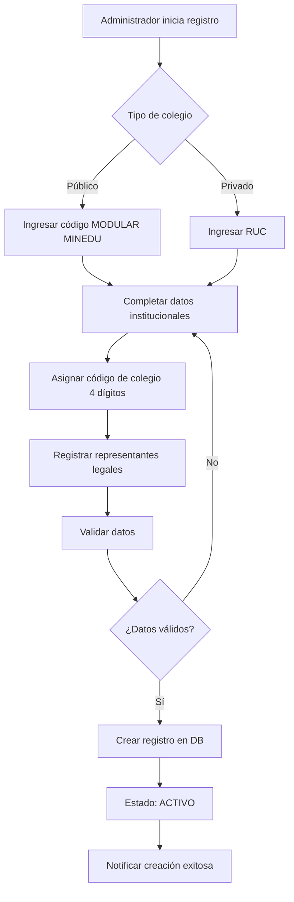
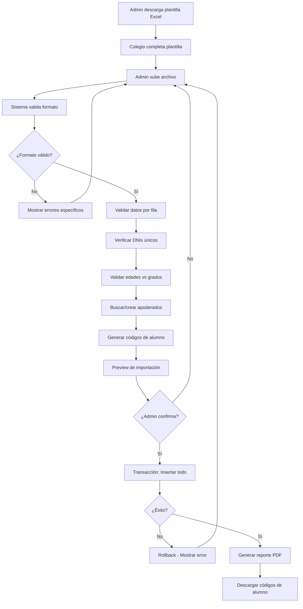
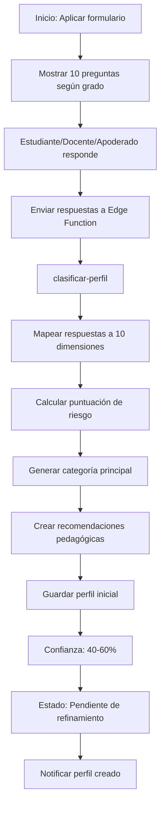
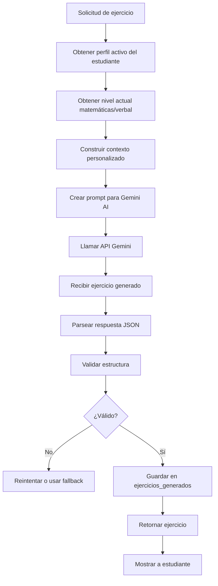
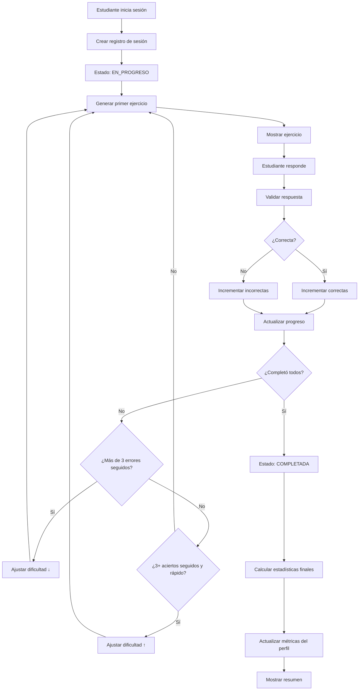
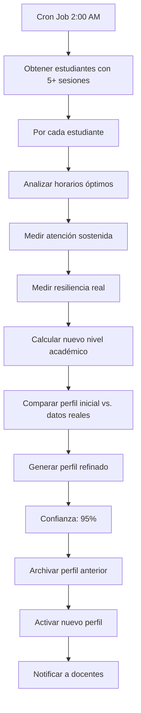

# Lógica de Negocio, Procesos y Relaciones del Sistema

## 📋 Índice

1. [Modelo de Datos y Relaciones](#modelo-de-datos-y-relaciones)
2. [Procesos de Negocio Principales](#procesos-de-negocio-principales)
3. [Lógica de Clasificación de Perfiles](#lógica-de-clasificación-de-perfiles)
4. [Lógica de Generación de Ejercicios](#lógica-de-generación-de-ejercicios)
5. [Sistema Adaptativo](#sistema-adaptativo)
6. [Flujos de Autenticación](#flujos-de-autenticación)
7. [Reglas de Negocio](#reglas-de-negocio)
8. [Estados y Transiciones](#estados-y-transiciones)

---

## 🗂️ Modelo de Datos y Relaciones

### Diagrama de Relaciones Principal

```
┌─────────────────┐
│    COLEGIOS     │
│  (Institución)  │
└────────┬────────┘
         │ 1
         │
         │ N
┌────────▼────────┐         ┌──────────────┐
│   ESTUDIANTES   │ N     1 │   GRADOS     │
│                 ├─────────┤  (1° a 6°)   │
└────────┬────────┘         └──────────────┘
         │ N
         │
         │ M (muchos a muchos)
         │
┌────────▼────────────┐     ┌──────────────┐
│  ESTUDIANTE_        │  N  │  APODERADOS  │
│  APODERADO          ├─────┤              │
└─────────────────────┘  1  └──────────────┘
         
         
┌─────────────────┐
│   ESTUDIANTES   │
└────────┬────────┘
         │ 1
         │
         │ 1 (activo)
┌────────▼────────┐
│    PERFILES     │
│ (Psicopedagóg.) │
└─────────────────┘


┌─────────────────┐
│   ESTUDIANTES   │
└────────┬────────┘
         │ 1
         │
         │ N
┌────────▼────────┐         ┌──────────────────┐
│    SESIONES     │ 1     N │  EJERCICIOS_     │
│                 ├─────────┤  GENERADOS       │
└────────┬────────┘         └──────────────────┘
         │ 1
         │
         │ N
┌────────▼────────┐
│   RESPUESTAS    │
│                 │
└─────────────────┘
```

### Relaciones Detalladas

#### 1. **COLEGIOS → ESTUDIANTES** (1:N)
- Un colegio tiene muchos estudiantes
- Cada estudiante pertenece a un solo colegio
- **FK**: `estudiantes.colegio_id → colegios.id`
- **Restricción**: ON DELETE RESTRICT (no se puede eliminar colegio con estudiantes activos)

#### 2. **GRADOS → ESTUDIANTES** (1:N)
- Un grado puede tener muchos estudiantes
- Cada estudiante está en un solo grado
- **FK**: `estudiantes.grado_id → grados.id`
- **Restricción**: ON DELETE RESTRICT (grados son catálogo fijo)

#### 3. **ESTUDIANTES ↔ APODERADOS** (N:M)
- Un estudiante puede tener varios apoderados (padre, madre, tutor)
- Un apoderado puede tener varios estudiantes (hermanos)
- **Tabla intermedia**: `estudiante_apoderado`
- **Campos adicionales**: `relacion` (padre/madre/tutor/otro), `es_principal` (boolean)

#### 4. **ESTUDIANTES → PERFILES** (1:1 activo)
- Un estudiante tiene un perfil activo
- Un estudiante puede tener múltiples perfiles históricos (versiones)
- **FK**: `perfiles.estudiante_id → estudiantes.id`
- **Restricción única**: `(estudiante_id, activo=true)` - solo un perfil activo por estudiante

#### 5. **ESTUDIANTES → SESIONES** (1:N)
- Un estudiante puede tener muchas sesiones de práctica
- Cada sesión pertenece a un solo estudiante
- **FK**: `sesiones.estudiante_id → estudiantes.id`
- **Restricción**: ON DELETE CASCADE (si se elimina estudiante, se eliminan sus sesiones)

#### 6. **SESIONES → RESPUESTAS** (1:N)
- Una sesión contiene muchas respuestas
- Cada respuesta pertenece a una sola sesión
- **FK**: `respuestas.sesion_id → sesiones.id`
- **Restricción**: ON DELETE CASCADE

#### 7. **EJERCICIOS_GENERADOS → RESPUESTAS** (1:N)
- Un ejercicio puede ser respondido por múltiples estudiantes
- Cada respuesta corresponde a un ejercicio
- **FK**: `respuestas.ejercicio_id → ejercicios_generados.id`
- **Restricción**: ON DELETE SET NULL (si se elimina ejercicio, se mantiene snapshot en respuesta)

---

## 🔄 Procesos de Negocio Principales

### Proceso 1: Registro de Colegio



**Reglas:**
- Código de colegio único (4 dígitos)
- RUC único para privados
- Código modular único para públicos
- Al menos un representante legal requerido

**Estados posibles:**
- `activo`: Operativo
- `inactivo`: Temporalmente suspendido
- `prueba`: En período de evaluación

---

### Proceso 2: Importación Masiva de Estudiantes



**Validaciones críticas:**
```javascript
// Validación de DNI único
async function validarDNI(dni, colegio_id) {
  const existe = await db.estudiantes.findOne({
    dni: dni,
    colegio_id: colegio_id
  })
  
  if (existe) {
    throw new Error(`DNI ${dni} ya existe en el colegio`)
  }
}

// Validación edad vs grado
function validarEdadGrado(fecha_nac, grado_numero) {
  const edad = calcularEdad(fecha_nac)
  const rangoEsperado = {
    1: [6, 7],
    2: [7, 8],
    3: [8, 9],
    4: [9, 10],
    5: [10, 11],
    6: [11, 12]
  }
  
  const [min, max] = rangoEsperado[grado_numero]
  
  // ADVERTENCIA, no error (permitir casos especiales)
  if (edad < min - 1 || edad > max + 2) {
    console.warn(`Edad ${edad} fuera de rango para grado ${grado_numero}`)
  }
}

// Matching de apoderados por DNI
async function buscarOCrearApoderado(datos_apoderado) {
  let apoderado = await db.apoderados.findOne({
    dni: datos_apoderado.dni
  })
  
  if (!apoderado) {
    // Crear nuevo apoderado
    apoderado = await db.apoderados.create(datos_apoderado)
  }
  
  return apoderado
}
```

---

### Proceso 3: Clasificación de Perfil Psicopedagógico



**Lógica de mapeo (ejemplo):**

```python
# Sistema implementado en clasificador.py

def mapear_respuestas_a_perfil(respuestas, grado):
    """
    Mapea las 10 respuestas a las dimensiones del perfil
    """
    perfil = {
        'estilo_aprendizaje': mapear_estilo(respuestas['P1']),
        'velocidad': mapear_velocidad(respuestas['P2']),
        'atencion': mapear_atencion(respuestas['P3']),
        'interes': mapear_interes(respuestas['P4']),
        'nivel_matematicas': mapear_nivel_mat(respuestas['P5']),
        'nivel_lectura': mapear_nivel_lec(respuestas['P6']),
        'motivacion': mapear_motivacion(respuestas['P7']),
        'frustracion': mapear_frustracion(respuestas['P8']),
        'trabajo': mapear_trabajo(respuestas['P9']),
        'energia': mapear_energia(respuestas['P10'])
    }
    
    return perfil

def calcular_riesgo(perfil):
    """
    Sistema de puntuación de riesgo
    """
    puntos = 0
    
    # FACTORES DE RIESGO ALTO (+3 puntos cada uno)
    if perfil['nivel_matematicas'] == 'basico':
        puntos += 3
    if perfil['nivel_lectura'] == 'inicial':
        puntos += 3
    if perfil['motivacion'] == 'baja':
        puntos += 3
    
    # FACTORES DE RIESGO MEDIO (+2 puntos)
    if perfil['atencion'] == 'baja':
        puntos += 2
    if perfil['frustracion'] == 'sensible':
        puntos += 2
    
    # FACTORES PROTECTORES (-2 puntos)
    if perfil['motivacion'] == 'alta':
        puntos -= 2
    if perfil['frustracion'] == 'resiliente':
        puntos -= 2
    
    # Clasificación final
    if puntos >= 7:
        return 'alto'
    elif puntos >= 3:
        return 'medio'
    else:
        return 'bajo'

def generar_categoria(perfil):
    """
    Asigna una categoría principal basada en combinación de dimensiones
    """
    categorias = {
        'cientifico_resiliente': {
            'criterios': [
                perfil['interes'] == 'cientifico',
                perfil['frustracion'] == 'resiliente',
                perfil['motivacion'] in ['alta', 'media']
            ]
        },
        'explorador_kinestesico': {
            'criterios': [
                perfil['estilo_aprendizaje'] == 'kinestesico',
                perfil['interes'] in ['deportivo', 'artistico']
            ]
        },
        'artista_creativo': {
            'criterios': [
                perfil['interes'] in ['artistico', 'literario'],
                perfil['nivel_lectura'] in ['desarrollado', 'experto']
            ]
        }
        # ... más categorías
    }
    
    for nombre, config in categorias.items():
        if all(config['criterios']):
            return nombre
    
    return 'perfil_general'
```

---

### Proceso 4: Generación de Ejercicios Personalizados



**Construcción de Prompt Personalizado:**

```javascript
// Edge Function: generar-ejercicios

async function construirPrompt(perfil, curso, dificultad) {
  const contextos = {
    'deportivo': 'contexto de deportes, fútbol, atletismo',
    'cientifico': 'contexto de experimentos, laboratorio, naturaleza',
    'artistico': 'contexto de arte, pintura, música',
    'literario': 'contexto de cuentos, lectura, literatura',
    'social': 'contexto de comunidad, familia, amigos',
    'matematico': 'contexto de puzzles, lógica, números'
  }
  
  const estilos = {
    'visual': 'Incluir descripciones visuales claras',
    'auditivo': 'Usar onomatopeyas y descripciones sonoras',
    'kinestesico': 'Enfatizar acciones y movimiento',
    'lectoescritura': 'Usar narrativas y texto detallado'
  }
  
  const velocidad_indicaciones = {
    'rapido': 'Ejercicio directo y conciso',
    'moderado': 'Ejercicio con pasos intermedios',
    'pausado': 'Ejercicio con explicación detallada paso a paso'
  }
  
  const prompt = `
Eres un experto en educación primaria peruana.

PERFIL DEL ESTUDIANTE:
- Grado: ${perfil.grado}
- Estilo de aprendizaje: ${perfil.estilo_aprendizaje}
- Interés principal: ${perfil.interes}
- Nivel en ${curso}: ${perfil['nivel_' + curso]}
- Velocidad: ${perfil.velocidad}

INSTRUCCIONES:
1. Crea un ejercicio de ${curso} nivel ${dificultad}
2. Usa ${contextos[perfil.interes]}
3. ${estilos[perfil.estilo_aprendizaje]}
4. ${velocidad_indicaciones[perfil.velocidad]}
5. Lenguaje apropiado para niños de ${calcularEdad(perfil.grado)} años

FORMATO DE RESPUESTA (JSON):
{
  "titulo": "Título atractivo del ejercicio",
  "enunciado": "Enunciado contextualizado al interés del estudiante",
  "opciones": [
    {"letra": "A", "texto": "Opción A"},
    {"letra": "B", "texto": "Opción B"},
    {"letra": "C", "texto": "Opción C"},
    {"letra": "D", "texto": "Opción D"}
  ],
  "respuesta_correcta": "A",
  "explicacion": "Explicación pedagógica paso a paso",
  "operacion_principal": "${curso === 'matematicas' ? 'suma/resta/multiplicacion/division' : 'comprension/vocabulario/analogia'}",
  "tags": ["tag1", "tag2", "tag3"]
}
`
  
  return prompt
}

// Llamada a Gemini AI
async function generarConGemini(prompt) {
  const response = await fetch(GEMINI_API_URL, {
    method: 'POST',
    headers: {
      'Content-Type': 'application/json',
      'Authorization': `Bearer ${GEMINI_API_KEY}`
    },
    body: JSON.stringify({
      model: 'gemini-1.5-flash',
      prompt: prompt,
      temperature: 0.7,  // Balance creatividad/consistencia
      max_tokens: 1000
    })
  })
  
  const data = await response.json()
  return JSON.parse(data.text)
}
```

---

### Proceso 5: Sesión de Práctica



**Lógica de Validación:**

```javascript
// Edge Function: validar-respuesta

async function validarRespuesta(sesion_id, ejercicio_id, respuesta_estudiante) {
  // 1. Obtener ejercicio
  const ejercicio = await db.ejercicios_generados.findById(ejercicio_id)
  
  // 2. Validar respuesta
  const es_correcta = ejercicio.respuesta_correcta === respuesta_estudiante
  
  // 3. Calcular tiempo de respuesta
  const tiempo_respuesta = Date.now() - respuesta_timestamp_inicio
  
  // 4. Guardar respuesta
  const respuesta = await db.respuestas.create({
    sesion_id: sesion_id,
    ejercicio_id: ejercicio_id,
    respuesta_seleccionada: respuesta_estudiante,
    es_correcta: es_correcta,
    tiempo_respuesta_ms: tiempo_respuesta,
    ejercicio_snapshot: ejercicio  // Backup por si se elimina
  })
  
  // 5. Actualizar estadísticas de sesión
  await actualizarEstadisticasSesion(sesion_id, es_correcta)
  
  // 6. Analizar si necesita ajuste de dificultad
  const ajuste = await analizarNecesidadAjuste(sesion_id)
  
  return {
    es_correcta: es_correcta,
    explicacion: ejercicio.explicacion,
    tiempo_respuesta: tiempo_respuesta,
    ajuste_dificultad: ajuste
  }
}

async function actualizarEstadisticasSesion(sesion_id, es_correcta) {
  const sesion = await db.sesiones.findById(sesion_id)
  
  if (es_correcta) {
    sesion.correctas++
  } else {
    sesion.incorrectas++
  }
  
  sesion.completados++
  sesion.porcentaje_acierto = (sesion.correctas / sesion.completados) * 100
  
  await sesion.save()
}

async function analizarNecesidadAjuste(sesion_id) {
  const ultimas_respuestas = await db.respuestas
    .find({ sesion_id })
    .sort({ created_at: -1 })
    .limit(5)
  
  const errores = ultimas_respuestas.filter(r => !r.es_correcta).length
  const aciertos = ultimas_respuestas.filter(r => r.es_correcta).length
  
  // Regla 1: Muchos errores consecutivos
  if (errores >= 3) {
    return { accion: 'reducir', razon: 'Muchos errores consecutivos' }
  }
  
  // Regla 2: Aciertos perfectos y rápidos
  const tiempo_promedio = ultimas_respuestas.reduce((sum, r) => 
    sum + r.tiempo_respuesta_ms, 0
  ) / ultimas_respuestas.length
  
  if (aciertos === 5 && tiempo_promedio < 10000) {  // < 10 segundos
    return { accion: 'aumentar', razon: 'Dominio del nivel actual' }
  }
  
  return { accion: 'mantener', razon: 'Rendimiento adecuado' }
}
```

---

### Proceso 6: Refinamiento Automático de Perfil



**Implementación del Análisis:**

```python
# Script de refinamiento nocturno

class AnalizadorPerfiles:
    def analizar_estudiante(self, estudiante_id):
        """
        Refina el perfil basado en datos reales de uso
        """
        sesiones = self.obtener_sesiones_recientes(estudiante_id, limit=10)
        
        if len(sesiones) < 5:
            return None  # Datos insuficientes
        
        # Análisis 1: Horario óptimo
        horario_optimo = self._detectar_horario_optimo(sesiones)
        
        # Análisis 2: Atención real
        atencion_real = self._medir_atencion_sostenida(sesiones)
        
        # Análisis 3: Resiliencia
        resiliencia_real = self._medir_resiliencia(sesiones)
        
        # Análisis 4: Nivel académico actualizado
        nivel_mat = self._calcular_nivel_matematicas(sesiones)
        nivel_lec = self._calcular_nivel_lectura(sesiones)
        
        # Consolidar perfil refinado
        perfil_refinado = {
            'energia': horario_optimo,
            'atencion': atencion_real,
            'frustracion': resiliencia_real,
            'nivel_matematicas': nivel_mat,
            'nivel_lectura': nivel_lec,
            'confianza_perfil': 95,  # Alta confianza con datos reales
            'version': '2.0',
            'fuente': 'analisis_comportamiento'
        }
        
        return perfil_refinado
    
    def _detectar_horario_optimo(self, sesiones):
        """
        Determina en qué momento del día el estudiante rinde mejor
        """
        por_horario = {'manana': [], 'tarde': [], 'noche': []}
        
        for sesion in sesiones:
            hora = sesion.created_at.hour
            
            if hora < 12:
                franja = 'manana'
            elif hora < 18:
                franja = 'tarde'
            else:
                franja = 'noche'
            
            por_horario[franja].append(sesion.porcentaje_acierto)
        
        # Calcular promedio por franja
        promedios = {
            k: sum(v) / len(v) if v else 0 
            for k, v in por_horario.items()
        }
        
        # Retornar franja con mejor rendimiento
        mejor_franja = max(promedios, key=promedios.get)
        
        mapeo = {
            'manana': 'matutino',
            'tarde': 'vespertino',
            'noche': 'nocturno'
        }
        
        return mapeo[mejor_franja]
    
    def _medir_atencion_sostenida(self, sesiones):
        """
        Calcula el tiempo promedio que mantiene la atención
        """
        tiempos_atencion = []
        
        for sesion in sesiones:
            # Tiempo total de la sesión
            tiempo_sesion = sesion.tiempo_total_segundos / 60  # minutos
            tiempos_atencion.append(tiempo_sesion)
        
        promedio = sum(tiempos_atencion) / len(tiempos_atencion)
        
        if promedio > 20:
            return 'alta'
        elif promedio > 10:
            return 'media'
        else:
            return 'baja'
    
    def _medir_resiliencia(self, sesiones):
        """
        Mide cómo maneja los errores: ¿abandona o reintenta?
        """
        respuestas = self.obtener_todas_respuestas(sesiones)
        
        errores = [r for r in respuestas if not r.es_correcta]
        
        if not errores:
            return 'resiliente'  # No hay errores para analizar
        
        # Contar cuántos errores llevaron a abandono vs. reintento
        abandonos = 0
        reintentos = 0
        
        for i, error in enumerate(errores):
            # Verificar si hay respuesta siguiente
            if i + 1 < len(respuestas):
                tiempo_siguiente = respuestas[i + 1].created_at - error.created_at
                
                if tiempo_siguiente.seconds < 60:  # Reintentó en < 1 min
                    reintentos += 1
                else:
                    abandonos += 1
        
        ratio = reintentos / (reintentos + abandonos) if (reintentos + abandonos) > 0 else 0.5
        
        if ratio > 0.6:
            return 'resiliente'
        elif ratio > 0.3:
            return 'intermedio'
        else:
            return 'sensible'
    
    def _calcular_nivel_matematicas(self, sesiones):
        """
        Ajusta nivel de matemáticas según desempeño real
        """
        respuestas_mat = self.obtener_respuestas_matematicas(sesiones)
        
        if not respuestas_mat:
            return 'intermedio'  # Valor por defecto
        
        aciertos_por_nivel = {
            'basico': [],
            'intermedio': [],
            'avanzado': []
        }
        
        for resp in respuestas_mat:
            ejercicio = resp.ejercicio_snapshot
            nivel = ejercicio['nivel']
            aciertos_por_nivel[nivel].append(resp.es_correcta)
        
        # Lógica de clasificación
        if aciertos_por_nivel['avanzado']:
            tasa_avanzado = sum(aciertos_por_nivel['avanzado']) / len(aciertos_por_nivel['avanzado'])
            if tasa_avanzado > 0.7:
                return 'avanzado'
        
        if aciertos_por_nivel['intermedio']:
            tasa_intermedio = sum(aciertos_por_nivel['intermedio']) / len(aciertos_por_nivel['intermedio'])
            if tasa_intermedio > 0.7:
                return 'intermedio'
        
        return 'basico'
```

---

## 🔐 Flujos de Autenticación

### Autenticación por Rol (v1.0 - MVP)

**Nota importante:**
- **JWT (JSON Web Tokens)**: Se implementará en v3.0
- **Sistema de Roles completo con RLS**: Se implementará en v3.0
- **v1.0 (MVP)**: Autenticación simple con sesiones básicas

```mermaid
graph TD
    A[Usuario ingresa credenciales] --> B{Tipo de usuario}
    B -->|Admin| C[Usuario: X{cod_colegio}{nombre} + Password]
    B -->|Estudiante| D[Código Alumno: AL{año}{cod_colegio}{corr} + PIN]
    B -->|Apoderado| E[Usuario: P{cod_colegio}{nombre} + Password]
    B -->|Docente| F[Usuario: D{cod_colegio}{nombre} + Password]
    B -->|Director| G[Usuario: R{cod_colegio}{nombre} + Password]
    
    C --> H[Verificar en tabla usuarios]
    D --> I[Verificar en tabla estudiantes]
    E --> H
    F --> H
    G --> H
    I --> J{¿Válido?}
    H --> J
    
    J -->|No| K[Error: Credenciales inválidas]
    J -->|Sí| L[Crear sesión simple]
    L --> M[Guardar rol en sesión]
    M --> N[Retornar sesión activa]
    N --> O[Redirigir a dashboard según rol]
```

### Sistema de Generación de Credenciales

**Formato con Código de Colegio (4 dígitos mínimo):**

```
{PREFIJO_ROL}{COD_COLEGIO_4DIG}{COMBINACION_NOMBRE}

Prefijos:
- X = Admin del sistema
- D = Docente
- P = Apoderado
- R = Director/Responsable
- A = Estudiante (casos especiales, normalmente usan código AL)

Ejemplos:
- X0000adminprincipal          (Admin global sin colegio)
- D2091carlosrosas            (Docente Carlos Rosas del colegio 2091)
- P2091juanperez              (Apodeado Juan Pérez del colegio 2091)
- R2091marialozano            (Directora María Lozano del colegio 2091)
- A2091anaisabelsalazarquiroz (Estudiante caso especial)
- AL2502091001                (Estudiante normal: código estándar)
```

**Algoritmo Progresivo de Combinaciones:**

```javascript
/**
 * Genera usuario con 7 niveles de combinación para evitar conflictos
 * Ejemplo: Ana Isabel Salazar Quiroz - Colegio 2091
 */
async function generarUsuario(tipo, nombres, apellidos, colegio_id, dni) {
  const prefijos = {
    'admin': 'X',
    'docente': 'D',
    'apoderado': 'P',
    'director': 'R',
    'estudiante': 'A'  // Solo para casos especiales
  }
  
  const prefijo = prefijos[tipo]
  
  // 1. Obtener código de colegio (4 dígitos mínimo)
  let codigoColegio = '0000'  // Admin global
  
  if (colegio_id) {
    const colegio = await db.colegios.findById(colegio_id)
    
    if (colegio.codigo_colegio) {
      codigoColegio = colegio.codigo_colegio.padStart(4, '0')
    } else {
      // Asignar correlativo desde 1000
      const maxCorrelativo = await db.colegios
        .find({ codigo_colegio: { $regex: /^\d{4}$/ } })
        .sort({ codigo_colegio: -1 })
        .limit(1)
      
      const siguiente = maxCorrelativo.length > 0 
        ? parseInt(maxCorrelativo[0].codigo_colegio) + 1 
        : 1000
      
      codigoColegio = siguiente.toString().padStart(4, '0')
      
      // Actualizar colegio con nuevo código
      await db.colegios.updateOne(
        { id: colegio_id },
        { codigo_colegio: codigoColegio }
      )
    }
  }
  
  // 2. Normalizar nombres y apellidos
  const nombresArray = nombres.trim().toLowerCase()
    .normalize('NFD')
    .replace(/[\u0300-\u036f]/g, '')  // Quitar tildes
    .split(' ')
    .filter(n => n.length > 0)
  
  const apellidosArray = apellidos.trim().toLowerCase()
    .normalize('NFD')
    .replace(/[\u0300-\u036f]/g, '')
    .split(' ')
    .filter(a => a.length > 0)
  
  // 3. Generar combinaciones progresivas (7 niveles)
  const combinaciones = generarCombinaciones(nombresArray, apellidosArray)
  
  // 4. Intentar cada combinación hasta encontrar disponible
  for (let i = 0; i < combinaciones.length; i++) {
    const usuario = prefijo + codigoColegio + combinaciones[i]
    const existe = await verificarUsuarioExiste(usuario)
    
    if (!existe) {
      // ¡Usuario disponible!
      return {
        usuario: usuario,
        email_futuro: `${usuario}@innovaeduia.edu.pe`,
        nivel_combinacion: i + 1,
        total_intentos: i + 1
      }
    }
  }
  
  // 5. Si ninguna combinación está disponible, generar error
  throw new Error(
    `ERROR_USUARIO_NO_DISPONIBLE: ` +
    `No se pudo generar usuario para ${nombres} ${apellidos}. ` +
    `Se agotaron las 7 combinaciones posibles. ` +
    `Contactar con soporte para actualizar sistema de generación.`
  )
}

/**
 * Genera 7 niveles de combinaciones de nombre
 * Ejemplo: Ana Isabel Salazar Quiroz
 */
function generarCombinaciones(nombresArray, apellidosArray) {
  const combinaciones = []
  
  // Nivel 1: Primera letra primer nombre + primer apellido
  // Ejemplo: A2091asalazarq
  if (nombresArray.length >= 1 && apellidosArray.length >= 1) {
    const inicial1 = nombresArray[0][0]
    const apellido1 = apellidosArray[0]
    combinaciones.push(inicial1 + apellido1.substring(0, 7))
  }
  
  // Nivel 2: Iniciales de ambos nombres + primer apellido
  // Ejemplo: A2091aisalazarq
  if (nombresArray.length >= 2 && apellidosArray.length >= 1) {
    const inicial1 = nombresArray[0][0]
    const inicial2 = nombresArray[1][0]
    const apellido1 = apellidosArray[0]
    combinaciones.push(inicial1 + inicial2 + apellido1.substring(0, 7))
  }
  
  // Nivel 3: Primer nombre completo + primer apellido
  // Ejemplo: A2091anasalazarq
  if (nombresArray.length >= 1 && apellidosArray.length >= 1) {
    const nombre1 = nombresArray[0]
    const apellido1 = apellidosArray[0]
    combinaciones.push(nombre1 + apellido1.substring(0, 7))
  }
  
  // Nivel 4: Primer nombre + inicial segundo + primer apellido
  // Ejemplo: A2091anaisalazarq
  if (nombresArray.length >= 2 && apellidosArray.length >= 1) {
    const nombre1 = nombresArray[0]
    const inicial2 = nombresArray[1][0]
    const apellido1 = apellidosArray[0]
    combinaciones.push(nombre1 + inicial2 + apellido1.substring(0, 7))
  }
  
  // Nivel 5: Ambos nombres + primer apellido
  // Ejemplo: A2091anaisabelsalazarq
  if (nombresArray.length >= 2 && apellidosArray.length >= 1) {
    const nombre1 = nombresArray[0]
    const nombre2 = nombresArray[1]
    const apellido1 = apellidosArray[0]
    combinaciones.push(nombre1 + nombre2 + apellido1.substring(0, 7))
  }
  
  // Nivel 6: Ambos nombres + primer apellido completo
  // Ejemplo: A2091anaisabelsalazar
  if (nombresArray.length >= 2 && apellidosArray.length >= 1) {
    const nombre1 = nombresArray[0]
    const nombre2 = nombresArray[1]
    const apellido1 = apellidosArray[0]
    combinaciones.push(nombre1 + nombre2 + apellido1)
  }
  
  // Nivel 7: Ambos nombres + ambos apellidos
  // Ejemplo: A2091anaisabelsalazarquiroz
  if (nombresArray.length >= 2 && apellidosArray.length >= 2) {
    const nombre1 = nombresArray[0]
    const nombre2 = nombresArray[1]
    const apellido1 = apellidosArray[0]
    const apellido2 = apellidosArray[1]
    combinaciones.push(nombre1 + nombre2 + apellido1 + apellido2)
  }
  
  // Si solo tiene 1 nombre, generar combinaciones alternativas
  if (nombresArray.length === 1) {
    const nombre = nombresArray[0]
    
    if (apellidosArray.length >= 2) {
      // Nombre + ambos apellidos
      combinaciones.push(nombre + apellidosArray[0] + apellidosArray[1])
    }
    
    if (apellidosArray.length >= 1) {
      // Nombre completo + apellido completo
      combinaciones.push(nombre + apellidosArray[0])
    }
  }
  
  return combinaciones
}

async function verificarUsuarioExiste(usuario) {
  // Verificar en tabla usuarios
  const existe = await db.usuarios.findOne({ usuario: usuario })
  return !!existe
}
```

**Ejemplos de Generación Real:**

```javascript
// Ejemplo 1: Ana Isabel Salazar Quiroz - Colegio 2091
const resultado1 = await generarUsuario(
  'estudiante', 
  'Ana Isabel', 
  'Salazar Quiroz', 
  'colegio_2091_id',
  '12345678'
)
// Intentos:
// 1. A2091asalazarq         ← Si está disponible, usar este
// 2. A2091aisalazarq        ← Si no, intentar este
// 3. A2091anasalazarq       ← Si no, este
// 4. A2091anaisalazarq      ← Y así sucesivamente...
// 5. A2091anaisabelsalazarq
// 6. A2091anaisabelsalazar
// 7. A2091anaisabelsalazarquiroz ← Último intento

// Ejemplo 2: Carlos Rosas - Colegio 2091 (Docente)
const resultado2 = await generarUsuario(
  'docente',
  'Carlos',
  'Rosas Vargas',
  'colegio_2091_id',
  '87654321'
)
// Resultado: D2091carlosrosas (o variación según disponibilidad)

// Ejemplo 3: María Lozano - Admin Global
const resultado3 = await generarUsuario(
  'admin',
  'María',
  'Lozano Fernández',
  null,  // Sin colegio
  '11223344'
)
// Resultado: X0000marialozano

// Ejemplo 4: Colegio sin código asignado
const colegio_nuevo = await db.colegios.create({
  nombre: 'Colegio San Martín',
  tipo_institucion: 'privada'
  // Sin codigo_colegio
})

const resultado4 = await generarUsuario(
  'docente',
  'Pedro',
  'Gutierrez',
  colegio_nuevo.id,
  '99887766'
)
// El sistema asigna automáticamente código 1000 (o siguiente disponible)
// Resultado: D1000pedrogutierrez
```

**Migración Futura a Email (v10.0):**

```javascript
// En v10.0, cuando tengamos dominio propio
// Solo agregar el sufijo @innovaeduia.edu.pe

const usuarios_actuales = await db.usuarios.find({})

for (const usuario of usuarios_actuales) {
  const email = `${usuario.usuario}@innovaeduia.edu.pe`
  
  await db.usuarios.updateOne(
    { id: usuario.id },
    { 
      email: email,
      tipo_autenticacion: 'email'
    }
  )
}

// Ejemplos de emails resultantes:
// D2091carlosrosas@innovaeduia.edu.pe
// P2091juanperez@innovaeduia.edu.pe
// A2091anaisabelsalazarquiroz@innovaeduia.edu.pe
```

**Manejo de Errores:**

```javascript
try {
  const usuario = await generarUsuario('docente', 'Ana Isabel', 'Salazar Quiroz', colegio_id, dni)
  console.log(`✅ Usuario generado: ${usuario.usuario}`)
  console.log(`📧 Email futuro: ${usuario.email_futuro}`)
  console.log(`🔢 Nivel de combinación usado: ${usuario.nivel_combinacion}/7`)
} catch (error) {
  if (error.message.startsWith('ERROR_USUARIO_NO_DISPONIBLE')) {
    // Log crítico para actualizar sistema
    await registrarErrorCritico({
      tipo: 'GENERACION_USUARIO_AGOTADA',
      nombres: 'Ana Isabel',
      apellidos: 'Salazar Quiroz',
      colegio_id: colegio_id,
      timestamp: new Date(),
      accion_requerida: 'Actualizar algoritmo de generación de usuarios'
    })
    
    // Notificar a administradores
    await notificarAdmins(
      'URGENTE: Sistema de generación de usuarios necesita actualización'
    )
    
    // Mostrar error al usuario
    throw new Error(
      'No se pudo generar usuario automáticamente. ' +
      'Por favor contacte con soporte técnico.'
    )
  }
}
```

---

**Implementación:**

```javascript
// Edge Function: autenticar

export async function handler(req) {
  const { tipo_usuario, credencial1, credencial2 } = await req.json()
  
  let usuario = null
  let rol = null
  
  switch (tipo_usuario) {
    case 'admin':
      usuario = await autenticarAdmin(credencial1, credencial2)
      rol = 'ADMIN'
      break
    
    case 'estudiante':
      usuario = await autenticarEstudiante(credencial1, credencial2)
      rol = 'ESTUDIANTE'
      break
    
    case 'apoderado':
      usuario = await autenticarApoderado(credencial1, credencial2)
      rol = 'APODERADO'
      break
    
    case 'docente':
      usuario = await autenticarDocente(credencial1, credencial2)
      rol = 'DOCENTE'
      break
    
    default:
      return { error: 'Tipo de usuario no válido' }
  }
  
  if (!usuario) {
    return { error: 'Credenciales inválidas' }
  }
  
  // Generar JWT
  const token = generarJWT({
    id: usuario.id,
    rol: rol,
    colegio_id: usuario.colegio_id,
    permisos: obtenerPermisos(rol)
  })
  
  return {
    token: token,
    usuario: {
      id: usuario.id,
      nombre: usuario.nombre_completo,
      rol: rol
    },
    redirect: obtenerDashboard(rol)
  }
}

async function autenticarEstudiante(codigo_alumno, pin) {
  const estudiante = await db.estudiantes.findOne({
    codigo_alumno: codigo_alumno,
    estado: 'activo'
  })
  
  if (!estudiante) return null
  
  // v1.0: PIN simple (sin hash por simplicidad MVP)
  if (estudiante.pin === pin) {
    return {
      id: estudiante.id,
      nombre_completo: `${estudiante.nombres} ${estudiante.apellidos}`,
      colegio_id: estudiante.colegio_id
    }
  }
  
  return null
}

function obtenerPermisos(rol) {
  const permisos = {
    ADMIN: [
      'gestionar_colegios',
      'importar_estudiantes',
      'ver_todo',
      'configurar_sistema'
    ],
    DOCENTE: [
      'ver_sus_estudiantes',
      'asignar_sesiones',
      'ver_reportes',
      'aplicar_formularios'
    ],
    ESTUDIANTE: [
      'resolver_ejercicios',
      'ver_su_perfil',
      'ver_su_progreso'
    ],
    APODERADO: [
      'ver_hijos',
      'ver_reportes_hijos',
      'aplicar_formulario'
    ]
  }
  
  return permisos[rol] || []
}

function obtenerDashboard(rol) {
  const dashboards = {
    ADMIN: '/admin/dashboard',
    DOCENTE: '/docente/mis-estudiantes',
    ESTUDIANTE: '/estudiante/practica',
    APODERADO: '/apoderado/mis-hijos'
  }
  
  return dashboards[rol] || '/'
}
```

---

## 📏 Reglas de Negocio

### Regla 1: Unicidad de Códigos de Alumno

```sql
-- Código único por colegio y año
-- Formato: AL{AA}{CCCC}{NNNN}

CREATE UNIQUE INDEX idx_codigo_alumno_unico 
ON estudiantes(codigo_alumno);

-- Trigger para generar automáticamente
CREATE TRIGGER trigger_generar_codigo_alumno
  BEFORE INSERT ON estudiantes
  FOR EACH ROW
  WHEN (NEW.codigo_alumno IS NULL)
  EXECUTE FUNCTION generar_codigo_alumno();
```

### Regla 2: Un Solo Perfil Activo por Estudiante

```sql
-- Constraint en DB
ALTER TABLE perfiles 
ADD CONSTRAINT unique_perfil_activo 
UNIQUE (estudiante_id, activo)
WHERE activo = true;
```

### Regla 3: Límite de Ejercicios por Día (v1.0)

```javascript
const MAX_EJERCICIOS_DIA = 30

async function validarLimiteEjercicios(estudiante_id) {
  const hoy = new Date()
  hoy.setHours(0, 0, 0, 0)
  
  const count = await db.respuestas.count({
    estudiante_id: estudiante_id,
    created_at: { $gte: hoy }
  })
  
  if (count >= MAX_EJERCICIOS_DIA) {
    throw new Error(`Has alcanzado el límite de ${MAX_EJERCICIOS_DIA} ejercicios por hoy`)
  }
  
  return true
}
```

### Regla 4: Ajuste Automático de Dificultad

```javascript
// Solo se ajusta después de mínimo 5 ejercicios
const MIN_EJERCICIOS_PARA_AJUSTE = 5

// Umbrales
const UMBRAL_REDUCIR = 0.4  // < 40% acierto
const UMBRAL_AUMENTAR = 0.85  // > 85% acierto

async function evaluarAjusteDificultad(sesion_id) {
  const sesion = await db.sesiones.findById(sesion_id)
  
  if (sesion.completados < MIN_EJERCICIOS_PARA_AJUSTE) {
    return null  // No hay suficientes datos
  }
  
  const tasa_acierto = sesion.porcentaje_acierto / 100
  
  if (tasa_acierto < UMBRAL_REDUCIR) {
    return 'reducir'
  } else if (tasa_acierto > UMBRAL_AUMENTAR) {
    return 'aumentar'
  }
  
  return 'mantener'
}
```

### Regla 5: Relación Apoderado-Estudiante

```javascript
// Un estudiante puede tener múltiples apoderados
// Pero SOLO UNO puede ser principal (para notificaciones)

async function asignarApoderadoPrincipal(estudiante_id, apoderado_id) {
  // Primero, quitar flag de principal a todos
  await db.estudiante_apoderado.updateMany(
    { estudiante_id: estudiante_id },
    { es_principal: false }
  )
  
  // Asignar nuevo principal
  await db.estudiante_apoderado.updateOne(
    { estudiante_id, apoderado_id },
    { es_principal: true }
  )
}
```

---

## 🔄 Estados y Transiciones

### Estados de Estudiante

```
ACTIVO ──────────► RETIRADO (voluntario)
   │
   └──────────────► TRASLADADO (a otro colegio)
   │
   └──────────────► EGRESADO (terminó 6° grado)

// No hay transiciones inversas (son definitivas)
```

### Estados de Sesión

```
EN_PROGRESO ─────► COMPLETADA (todos ejercicios resueltos)
     │
     └────────────► ABANDONADA (inactividad > 30 min)

ABANDONADA ──────► EN_PROGRESO (puede retomar)
```

### Estados de Perfil

```
INICIAL (confianza 40-60%)
   │
   │ (después de 5 sesiones)
   │
   ▼
REFINADO (confianza 95%)
   │
   │ (cada mes se re-evalúa)
   │
   ▼
ACTUALIZADO (confianza se mantiene)
```

---

## 📊 Métricas y KPIs del Sistema

### Métricas por Estudiante

```javascript
{
  // Rendimiento académico
  porcentaje_acierto_global: 75.5,
  porcentaje_acierto_matematicas: 80.0,
  porcentaje_acierto_verbal: 71.0,
  
  // Uso de la plataforma
  sesiones_totales: 15,
  sesiones_completadas: 12,
  sesiones_abandonadas: 3,
  tasa_completado: 80.0,  // %
  
  // Engagement
  dias_activos: 10,
  racha_actual: 3,  // días consecutivos
  racha_maxima: 5,
  tiempo_total_plataforma: 420,  // minutos
  promedio_tiempo_sesion: 28,  // minutos
  
  // Progreso del perfil
  confianza_perfil: 95,
  versiones_perfil: 2,
  ultima_actualizacion: '2025-11-20',
  
  // Alertas
  nivel_riesgo: 'bajo',
  requiere_intervencion: false
}
```

### Métricas por Colegio

```javascript
{
  estudiantes_totales: 250,
  estudiantes_activos: 230,
  estudiantes_riesgo_alto: 15,
  estudiantes_riesgo_medio: 45,
  
  docentes_registrados: 12,
  apoderados_registrados: 180,
  
  sesiones_mes_actual: 1250,
  ejercicios_resueltos_mes: 8500,
  
  porcentaje_acierto_promedio: 72.5,
  
  top_curso: 'matematicas',
  nivel_promedio_matematicas: 'intermedio',
  nivel_promedio_verbal: 'intermedio'
}
```

---

## 🎯 Casos de Uso Detallados

### Caso 1: Estudiante Nuevo - Primer Uso

**Actor:** Estudiante (Juan, 3° grado)  
**Objetivo:** Completar su primera sesión de práctica

**Flujo:**
1. Admin registró previamente a Juan en el sistema
2. Juan recibe código de alumno: `AL2502340045`
3. Juan ingresa por primera vez
4. Sistema detecta: NO tiene perfil → Redirigir a formulario
5. Juan responde las 10 preguntas (adaptadas a 3° grado)
6. Sistema clasifica: "Explorador Kinestésico, Riesgo Medio"
7. Sistema muestra: "¡Hola Juan! Tu perfil está listo. ¡Empecemos a practicar!"
8. Juan ingresa a "Práctica de Matemáticas"
9. Sistema genera primer ejercicio (nivel intermedio, contexto deportivo)
10. Juan resuelve ejercicio en 2 minutos → Correcto ✅
11. Sistema genera siguiente ejercicio
12. Continúa hasta completar 5 ejercicios
13. Sistema muestra resumen: "¡Bien hecho! 4 de 5 correctas (80%)"

### Caso 2: Docente Asigna Tarea

**Actor:** Docente (Prof. María)  
**Objetivo:** Asignar sesión de práctica a su aula de 4° grado

**Flujo:**
1. Docente ingresa con usuario `DOC-0234-001`
2. Ve lista de sus estudiantes (4° A - 25 estudiantes)
3. Selecciona: "Asignar sesión grupal"
4. Configura:
   - Curso: Matemáticas
   - Tema: Multiplicaciones
   - Cantidad: 10 ejercicios
   - Fecha límite: 25/11/2025
5. Selecciona todos los estudiantes de 4° A
6. Sistema confirma: "Sesión asignada a 25 estudiantes"
7. Sistema envía notificación a cada estudiante
8. Docente puede monitorear progreso en tiempo real
9. Al día siguiente, docente ve reporte: 22/25 completaron la tarea

### Caso 3: Apoderado Consulta Progreso

**Actor:** Apoderado (Sr. Carlos, padre de 2 hijos)  
**Objetivo:** Ver el progreso de sus hijos

**Flujo:**
1. Apoderado ingresa con DNI + contraseña
2. Sistema muestra dashboard: "Tus hijos"
3. Ve tarjetas de sus 2 hijos:
   - Ana (5° grado): ✅ Rendimiento excelente, 90% acierto
   - Luis (2° grado): ⚠️ Necesita apoyo, 55% acierto
4. Click en Luis para ver detalle
5. Sistema muestra:
   - Perfil: "Visual, atención baja, nivel básico"
   - Recomendaciones: "Practicar en tardes, sesiones cortas"
   - Gráfico de progreso últimos 7 días
   - Ejercicios donde tiene más dificultad: Restas con llevada
6. Apoderado descarga reporte PDF
7. Sistema sugiere: "¿Quieres aplicar el formulario nuevamente? Han pasado 30 días"

---

## 🔍 Validaciones y Constraints

### Validaciones a Nivel de Base de Datos

```sql
-- 1. Estado de estudiante solo valores permitidos
ALTER TABLE estudiantes 
ADD CONSTRAINT check_estado_estudiante 
CHECK (estado IN ('activo', 'retirado', 'trasladado', 'egresado'));

-- 2. Porcentaje de acierto entre 0 y 100
ALTER TABLE sesiones 
ADD CONSTRAINT check_porcentaje 
CHECK (porcentaje_acierto >= 0 AND porcentaje_acierto <= 100);

-- 3. Tiempo de respuesta positivo
ALTER TABLE respuestas 
ADD CONSTRAINT check_tiempo_positivo 
CHECK (tiempo_respuesta_ms > 0);

-- 4. Confianza del perfil entre 0 y 100
ALTER TABLE perfiles 
ADD CONSTRAINT check_confianza 
CHECK (confianza_perfil >= 0 AND confianza_perfil <= 100);

-- 5. Número de grado válido
ALTER TABLE grados 
ADD CONSTRAINT check_grado_valido 
CHECK (numero BETWEEN 1 AND 6);

-- 6. DNI peruano (8 dígitos)
ALTER TABLE apoderados 
ADD CONSTRAINT check_dni_formato 
CHECK (dni ~ '^\d{8}$');

-- 7. RUC peruano (11 dígitos)
ALTER TABLE colegios 
ADD CONSTRAINT check_ruc_formato 
CHECK (ruc IS NULL OR ruc ~ '^\d{11}$');
```

### Validaciones a Nivel de Aplicación

```javascript
// Validación de edad vs grado
function validarEdadGrado(fecha_nac, grado_numero) {
  const edad = calcularEdad(fecha_nac)
  const esperado = {
    1: [6, 7], 2: [7, 8], 3: [8, 9],
    4: [9, 10], 5: [10, 11], 6: [11, 12]
  }
  
  const [min, max] = esperado[grado_numero]
  
  if (edad < min - 1 || edad > max + 2) {
    return {
      valido: false,
      advertencia: `Edad ${edad} inusual para grado ${grado_numero}. Rango esperado: ${min}-${max} años.`
    }
  }
  
  return { valido: true }
}

// Validación de formato de código de alumno
function validarCodigoAlumno(codigo) {
  const regex = /^AL\d{10}$/
  
  if (!regex.test(codigo)) {
    throw new Error('Formato de código inválido. Debe ser: AL + 10 dígitos')
  }
  
  const año = parseInt(codigo.substring(2, 4))
  const año_actual = new Date().getFullYear() % 100
  
  if (año > año_actual) {
    throw new Error('Año del código es futuro')
  }
  
  return true
}

// Validación de sesión activa
async function validarSesionActiva(estudiante_id) {
  const sesion_activa = await db.sesiones.findOne({
    estudiante_id: estudiante_id,
    estado: 'en_progreso'
  })
  
  if (sesion_activa) {
    // Verificar si está realmente abandonada (> 30 min inactivo)
    const ultimo_ejercicio = await db.respuestas
      .findOne({ sesion_id: sesion_activa.id })
      .sort({ created_at: -1 })
    
    const minutos_inactivo = (Date.now() - ultimo_ejercicio.created_at) / 60000
    
    if (minutos_inactivo > 30) {
      // Marcar como abandonada
      await db.sesiones.updateOne(
        { id: sesion_activa.id },
        { estado: 'abandonada' }
      )
      
      return null  // Puede crear nueva sesión
    }
    
    return sesion_activa  // Debe continuar esta sesión
  }
  
  return null  // Puede crear nueva sesión
}
```

---

## 🚀 Optimizaciones de Performance

### Generación de Ejercicios con Gemini AI (v1.0 - MVP)

**Estrategia para MVP:** Generación directa mediante llamadas a API de Gemini.

**Propuesta futura:** Sistema de pool reutilizable documentado en `PROPUESTA_POOL_EJERCICIOS.md`

```javascript
/**
 * Genera ejercicio personalizado con Gemini AI (v1.0 - MVP)
 * Generación directa sin caché ni pool
 */
async function obtenerEjercicio(estudiante_id, curso, dificultad) {
  const perfil = await obtenerPerfilActivo(estudiante_id)
  
  // Construir prompt personalizado
  const prompt = construirPromptPersonalizado(perfil, curso, dificultad)
  
  // Llamar a Gemini AI
  const ejercicio = await generarConGemini(prompt)
  
  // Guardar ejercicio generado
  const ejercicio_guardado = await db.ejercicios_generados.create({
    estudiante_id: estudiante_id,
    curso: curso,
    nivel: perfil[`nivel_${curso}`],
    dificultad: dificultad,
    
    titulo: ejercicio.titulo,
    enunciado: ejercicio.enunciado,
    opciones: ejercicio.opciones,
    respuesta_correcta: ejercicio.respuesta_correcta,
    explicacion: ejercicio.explicacion,
    operacion_principal: ejercicio.operacion_principal,
    apoyo_visual: ejercicio.apoyo_visual,
    tags: ejercicio.tags || [],
    
    generado_por: 'gemini',
    prompt_usado: prompt
  })
  
  return ejercicio_guardado
}

/**
 * Construye prompt personalizado según perfil del estudiante
 */
function construirPromptPersonalizado(perfil, curso, dificultad) {
  const contextos = {
    'deportivo': 'contexto de deportes, fútbol, atletismo, juegos',
    'cientifico': 'contexto de experimentos, laboratorio, naturaleza, ciencia',
    'artistico': 'contexto de arte, pintura, música, creatividad',
    'literario': 'contexto de cuentos, lectura, literatura, historias',
    'social': 'contexto de comunidad, familia, amigos, sociedad',
    'matematico': 'contexto de puzzles, lógica, números, patrones'
  }
  
  const estilos = {
    'visual': 'Incluir descripciones visuales claras y detalladas',
    'auditivo': 'Usar onomatopeyas y descripciones sonoras',
    'kinestesico': 'Enfatizar acciones, movimiento y práctica',
    'lectoescritura': 'Usar narrativas y texto detallado'
  }
  
  const velocidad_indicaciones = {
    'rapido': 'Ejercicio directo y conciso',
    'moderado': 'Ejercicio con pasos intermedios',
    'pausado': 'Ejercicio con explicación detallada paso a paso'
  }
  
  const edad_aproximada = {
    1: 6, 2: 7, 3: 8, 4: 9, 5: 10, 6: 11
  }
  
  const prompt = `
Eres un experto en educación primaria peruana especializado en crear ejercicios personalizados.

PERFIL DEL ESTUDIANTE:
- Grado: ${perfil.grado_numero}° (aproximadamente ${edad_aproximada[perfil.grado_numero]} años)
- Estilo de aprendizaje: ${perfil.estilo_aprendizaje}
- Interés principal: ${perfil.interes}
- Nivel en ${curso}: ${perfil['nivel_' + curso]}
- Velocidad de procesamiento: ${perfil.velocidad}
- Nivel de atención: ${perfil.atencion}

INSTRUCCIONES:
1. Crea un ejercicio de ${curso} nivel ${perfil['nivel_' + curso]} con dificultad ${dificultad}
2. Usa ${contextos[perfil.interes] || 'contexto general apropiado para niños'}
3. ${estilos[perfil.estilo_aprendizaje]}
4. ${velocidad_indicaciones[perfil.velocidad]}
5. Lenguaje claro y apropiado para niños de ${edad_aproximada[perfil.grado_numero]} años
6. El ejercicio debe ser motivador y acorde a sus intereses

FORMATO DE RESPUESTA (JSON):
{
  "titulo": "Título atractivo del ejercicio (máximo 60 caracteres)",
  "enunciado": "Enunciado contextualizado al interés del estudiante",
  "opciones": [
    {"letra": "A", "texto": "Opción A"},
    {"letra": "B", "texto": "Opción B"},
    {"letra": "C", "texto": "Opción C"},
    {"letra": "D", "texto": "Opción D"}
  ],
  "respuesta_correcta": "A",
  "explicacion": "Explicación pedagógica paso a paso de por qué la respuesta es correcta",
  "operacion_principal": "${curso === 'matematicas' ? 'suma/resta/multiplicacion/division/fracciones/geometria' : 'comprension/vocabulario/analogia/ortografia/sinonimos'}",
  "tags": ["tag1", "tag2", "tag3"]
}

IMPORTANTE:
- El enunciado debe ser claro y sin ambigüedades
- Las opciones incorrectas deben ser plausibles pero claramente incorrectas
- La explicación debe ayudar al estudiante a entender el concepto
`
  
  return prompt
}

/**
 * Llamada a Gemini AI para generar ejercicio
 */
async function generarConGemini(prompt) {
  const response = await fetch(GEMINI_API_URL, {
    method: 'POST',
    headers: {
      'Content-Type': 'application/json',
      'Authorization': `Bearer ${GEMINI_API_KEY}`
    },
    body: JSON.stringify({
      model: 'gemini-1.5-flash',
      prompt: prompt,
      temperature: 0.7,  // Balance entre creatividad y consistencia
      max_tokens: 1000,
      response_format: { type: 'json' }
    })
  })
  
  if (!response.ok) {
    throw new Error(`Error Gemini API: ${response.statusText}`)
  }
  
  const data = await response.json()
  const ejercicio = JSON.parse(data.text)
  
  // Validar estructura del ejercicio
  validarEstructuraEjercicio(ejercicio)
  
  return ejercicio
}

/**
 * Valida que el ejercicio tenga la estructura correcta
 */
function validarEstructuraEjercicio(ejercicio) {
  const campos_requeridos = [
    'titulo',
    'enunciado',
    'opciones',
    'respuesta_correcta',
    'explicacion',
    'operacion_principal'
  ]
  
  for (const campo of campos_requeridos) {
    if (!ejercicio[campo]) {
      throw new Error(`Ejercicio generado sin campo: ${campo}`)
    }
  }
  
  if (!Array.isArray(ejercicio.opciones) || ejercicio.opciones.length !== 4) {
    throw new Error('Ejercicio debe tener exactamente 4 opciones')
  }
  
  const letras = ejercicio.opciones.map(o => o.letra)
  if (!letras.includes(ejercicio.respuesta_correcta)) {
    throw new Error('Respuesta correcta no está en las opciones')
  }
}
```

**Características del Sistema v1.0:**

✅ **Simple y directo**: Fácil de implementar y debuggear  
✅ **Personalizado**: Cada ejercicio adaptado al perfil del estudiante  
✅ **Sin complejidad adicional**: No requiere lógica de pool o caché  
✅ **Rápido de desarrollar**: 2-3 días vs 2 semanas del pool  
✅ **Ideal para MVP**: Validar concepto antes de optimizar  

**Nota:** Ver `PROPUESTA_POOL_EJERCICIOS.md` para sistema optimizado futuro (v2.0+)

### Optimizaciones Futuras (v2.0+)

**Nota:** Para v1.0 (MVP) no se implementa caché ni pool. Los ejercicios se generan bajo demanda.

**Para v2.0+** se evaluará implementar sistema de pool reutilizable (ver `PROPUESTA_POOL_EJERCICIOS.md`)

```javascript
/**
 * v2.0: Cron para mantener pool de ejercicios
 * (NO implementar en v1.0)
 */
export async function mantenimientoPoolNocturno() {
  console.log('🌙 Iniciando mantenimiento nocturno del pool de ejercicios...')
  
  const MIN_EJERCICIOS_POR_COMBINACION = 20
  const cursos = ['matematicas', 'verbal']
  const dificultades = ['facil', 'medio', 'dificil']
  
  // Obtener todos los grados activos
  const grados = await db.grados.find({})
  
  // Obtener perfiles únicos para determinar combinaciones necesarias
  const perfiles_unicos = await db.perfiles.aggregate([
    { $match: { activo: true } },
    { $group: {
        _id: {
          grado_id: '$grado_id',
          estilo_aprendizaje: '$estilo_aprendizaje',
          interes: '$interes'
        }
      }
    }
  ])
  
  let total_generados = 0
  let total_verificados = 0
  
  for (const grado of grados) {
    for (const curso of cursos) {
      // Determinar niveles según curso
      const niveles = ['basico', 'intermedio', 'avanzado']
      
      for (const nivel of niveles) {
        for (const dificultad of dificultades) {
          // Contar ejercicios existentes en pool
          const count = await db.ejercicios_pool.count({
            grado_id: grado.id,
            curso: curso,
            nivel: nivel,
            dificultad: dificultad
          })
          
          total_verificados++
          
          // Si faltan ejercicios, generar
          if (count < MIN_EJERCICIOS_POR_COMBINACION) {
            const faltantes = MIN_EJERCICIOS_POR_COMBINACION - count
            
            console.log(
              `📝 Generando ${faltantes} ejercicios: ` +
              `Grado ${grado.numero} | ${curso} | ${nivel} | ${dificultad}`
            )
            
            // Generar ejercicios faltantes
            for (let i = 0; i < faltantes; i++) {
              try {
                // Crear perfil temporal para generación
                const perfil_temp = {
                  grado_id: grado.id,
                  [`nivel_${curso}`]: nivel,
                  estilo_aprendizaje: 'visual',  // Por defecto
                  interes: 'general'
                }
                
                const ejercicio = await generarConGemini(
                  perfil_temp, 
                  curso, 
                  dificultad
                )
                
                await agregarAlPool(ejercicio, perfil_temp)
                total_generados++
                
              } catch (error) {
                console.error(
                  `❌ Error generando ejercicio: ${error.message}`
                )
              }
              
              // Rate limit: 1 segundo entre requests
              await sleep(1000)
            }
          }
        }
      }
    }
  }
  
  // Limpieza de ejercicios problemáticos (v4.0)
  const ejercicios_problematicos = await limpiarEjerciciosProblematicos()
  
  console.log(
    `✅ Mantenimiento completado:\n` +
    `   - Combinaciones verificadas: ${total_verificados}\n` +
    `   - Ejercicios generados: ${total_generados}\n` +
    `   - Ejercicios removidos (baja calidad): ${ejercicios_problematicos}\n` +
    `   - Total en pool: ${await db.ejercicios_pool.count({})}`
  )
}

/**
 * Limpia ejercicios con múltiples reportes de error (v4.0)
 */
async function limpiarEjerciciosProblematicos() {
  const UMBRAL_REPORTES = 3
  const MIN_USOS_PARA_VALIDAR = 10
  
  const problematicos = await db.ejercicios_pool.find({
    reportes_error: { $gte: UMBRAL_REPORTES },
    veces_usado: { $gte: MIN_USOS_PARA_VALIDAR }
  })
  
  // Archivar en lugar de eliminar (para análisis)
  for (const ejercicio of problematicos) {
    await db.ejercicios_pool_archivados.create({
      ...ejercicio.toObject(),
      fecha_archivado: new Date(),
      razon: 'alto_numero_reportes_error'
    })
    
    await db.ejercicios_pool.deleteOne({ id: ejercicio.id })
  }
  
  return problematicos.length
}

// Helper function
function sleep(ms) {
  return new Promise(resolve => setTimeout(resolve, ms))
}
```

**Estadísticas del Pool:**

```javascript
/**
 * Vista para monitorear salud del pool
 */
async function obtenerEstadisticasPool() {
  const stats = await db.ejercicios_pool.aggregate([
    {
      $group: {
        _id: {
          grado_id: '$grado_id',
          curso: '$curso',
          nivel: '$nivel',
          dificultad: '$dificultad'
        },
        total: { $sum: 1 },
        promedio_uso: { $avg: '$veces_usado' },
        promedio_reportes: { $avg: '$reportes_error' }
      }
    },
    {
      $sort: { total: -1 }
    }
  ])
  
  return stats
}
```

### Índices Optimizados

```sql
-- Índices compuestos para queries frecuentes
CREATE INDEX idx_estudiante_colegio_grado 
ON estudiantes(colegio_id, grado_id, estado);

CREATE INDEX idx_sesion_estudiante_estado 
ON sesiones(estudiante_id, estado, created_at DESC);

CREATE INDEX idx_respuesta_sesion_fecha 
ON respuestas(sesion_id, created_at);

CREATE INDEX idx_perfil_activo 
ON perfiles(estudiante_id, activo) 
WHERE activo = true;

CREATE INDEX idx_ejercicio_curso_nivel 
ON ejercicios_generados(curso, nivel, dificultad);
```

---

## 📝 Resumen de Flujos Críticos

### Notas de Implementación por Versión

**v1.0 (MVP) - Implementación Actual:**
- ✅ Sistema de credenciales con código de colegio (4 dígitos)
- ✅ Autenticación simple con sesiones básicas
- ✅ Pool de ejercicios generador por IA (sin caché temporal)
- ✅ Roles "soft" (validación solo en frontend)
- ❌ Sin JWT (se posterga para v3.0)
- ❌ Sin RLS completo (se posterga para v3.0)

**v3.0 - Seguridad Avanzada:**
- 🔜 Implementación de JWT (JSON Web Tokens)
- 🔜 Row Level Security (RLS) completo en PostgreSQL
- 🔜 Roles con permisos granulares
- 🔜 Auditoría completa de acciones

**v10.0 - Producción Oficial:**
- 🔜 Migración a emails `@innovaeduia.edu.pe`
- 🔜 SSO (Single Sign-On)
- 🔜 Integración con sistemas externos

---

### Top 5 Flujos Más Importantes

1. **Clasificación Inicial** → Determina todo el sistema adaptativo
2. **Generación de Ejercicios** → Core del valor del producto
3. **Validación de Respuestas** → Feedback inmediato al estudiante
4. **Refinamiento Automático** → Mejora continua sin intervención manual
5. **Importación Masiva** → Onboarding rápido de colegios

### Dependencias entre Procesos

```
Importación Estudiantes
         │
         ▼
Clasificación Perfil ──────► Generación Ejercicios
         │                            │
         │                            ▼
         │                    Sesión Práctica
         │                            │
         │                            ▼
         │                    Validación Respuestas
         │                            │
         └────────────────────────────┘
                      │
                      ▼
              Refinamiento Perfil
```

---

## 🎓 Glosario de Términos

- **Perfil Psicopedagógico**: Conjunto de 10 dimensiones que caracterizan el estilo de aprendizaje del estudiante
- **Clasificación**: Proceso de asignar valores a las 10 dimensiones basado en formulario
- **Refinamiento**: Actualización del perfil basada en datos reales de uso
- **Sesión**: Conjunto de ejercicios que el estudiante resuelve en una sola sesión de práctica
- **Ejercicio Generado**: Problema creado por IA personalizado al perfil del estudiante
- **Nivel de Riesgo**: Clasificación (bajo/medio/alto) de probabilidad de bajo rendimiento académico
- **Código de Alumno**: Identificador único formato `AL{AA}{CCCC}{NNNN}`
- **Confianza del Perfil**: Porcentaje que indica qué tan preciso es el perfil (40-60% inicial, 95% refinado)
- **Adaptación Automática**: Ajuste de dificultad basado en rendimiento en tiempo real
- **Análisis de Métricas**: Sistema estadístico que evalúa comportamiento para refinar perfil

---

**Documento:** `LOGICA_Y_PROCESOS.md`  
**Versión:** 1.0  
**Fecha:** 22/11/2025  
**Autor:** Sistema de Análisis  
**Estado:** Borrador inicial para revisión
